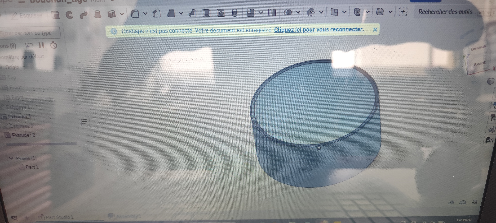
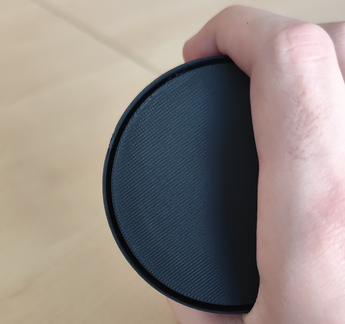
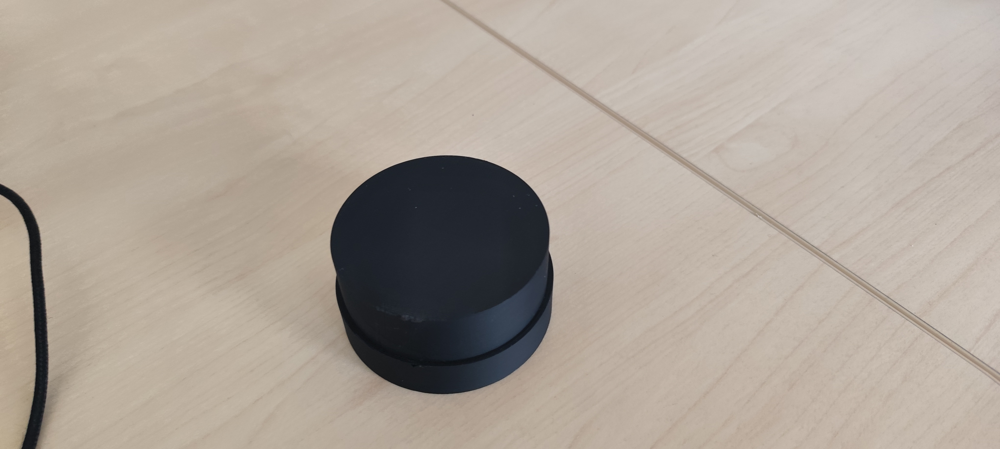
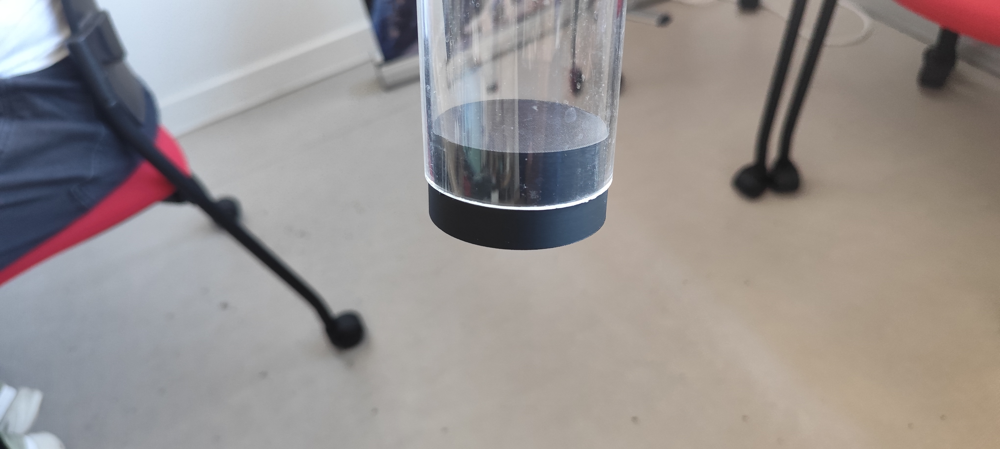

# Bouchon pour tiges filetées

## Besoin

Les tiges filetées devaient être stockées dans des tubes en plastique afin de faciliter leur rangement. Il fallait donc trouver une solution pour fermer l'extrémité du tube et empêcher les tiges filetées de sortir.

## But du projet

Le but était de concevoir un bouchon adapté aux dimensions du tube, puis de l'imprimer en 3D afin de pouvoir fermer le tube et stocker les tiges filetées plus facilement.

## Conception du bouchon

Pour commencer, j'ai mesuré le tube afin de pouvoir concevoir une pièce adaptée à ses dimensions. Le tube possède un diamètre extérieur de **6,42 cm** et une épaisseur de **0,3 cm**.

J'ai ensuite réalisé le modèle 3D sur [Onshape](../Explication/Definitions.md#onshape).

J'ai commencé par créer une [esquisse](../Explication/Definitions.md#esquisse) contenant un cercle de **6,82 cm**. J'ai ensuite réalisé une [extrusion](../Explication/Definitions.md#extrusion) de **35 mm** afin de créer le corps du bouchon.

*Modèle 3D du bouchon sur Onshape.*

J'ai ensuite créé une deuxième [esquisse](../Explication/Definitions.md#esquisse) avec deux cercles de **6,72 cm** et **6,42 cm**. J'ai réalisé une nouvelle [extrusion](../Explication/Definitions.md#extrusion) en enlèvement de matière afin de créer l'espace permettant au tube de s'insérer dans le bouchon.

L'objectif était d'obtenir une pièce suffisamment épaisse pour être résistante tout en permettant au tube de s'insérer correctement.

## Premier essai

Après avoir imprimé une première version du bouchon, j'ai effectué un test directement sur le tube.

Le bouchon ne rentrait pas correctement. Le problème venait des bordures que j'avais ajoutées afin d'améliorer la fixation du bouchon au tube. Ces bordures étaient trop fines et empêchaient la pièce de s'insérer correctement.

*Premier essai du bouchon.*

J'ai donc repris le modèle 3D et supprimé le contour afin d'obtenir une forme plus simple, proche d'un bouchon classique.

## Deuxième version

Après avoir modifié le modèle, j'ai réalisé une nouvelle impression.

Cette fois, le bouchon s'insérait correctement dans le tube. Cependant, il ne tenait pas suffisamment en place et pouvait être retiré facilement.

*Deuxième version du bouchon.*

Pour résoudre ce problème, j'ai utilisé de la **super glue** afin de fixer définitivement le bouchon au tube. Comme la colle utilisée était une colle en gel qui réagit avec l'humidité, j'ai porté des gants afin d'éviter tout contact avec la peau.

J'ai appliqué la colle sur le bouchon avant de l'insérer dans le tube, puis j'ai attendu son séchage.

*Bouchon fixé sur le tube.*

## Résultat

La modification du modèle et l'utilisation de la colle ont permis d'obtenir un bouchon qui s'insère correctement dans le tube et qui reste fixé.

Ce projet m'a permis de comprendre l'importance des essais après une impression 3D. Une pièce peut sembler correcte sur le modèle 3D mais nécessiter des modifications une fois imprimée et testée dans son environnement réel.

J'ai également pu mettre en pratique la conception sur [Onshape](../Explication/Definitions.md#onshape), la prise de mesures et la modification d'une pièce à partir des résultats d'un premier essai.