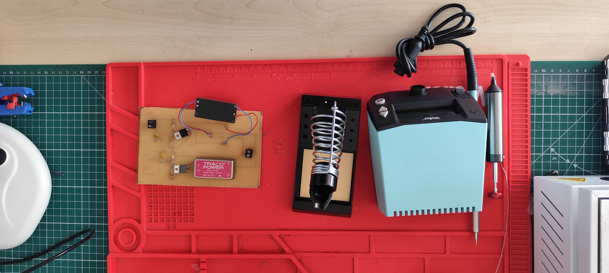
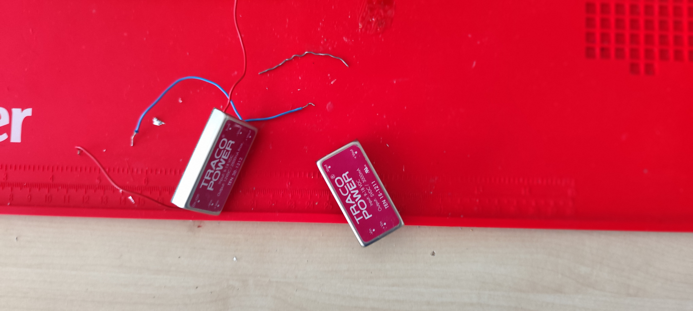

---
layout: default
parent: Projets
nav_order: 8
title: Récupération de composants électroniques
---

# Récupération de composants électroniques

## Besoin

Le [Makerspace](../Explication/Definitions.md#makerspace) possède différents composants électroniques présents sur des cartes qui ne sont plus utilisées.

Plutôt que de jeter directement ces composants avec les cartes, il est possible de récupérer certaines pièces afin de pouvoir les réutiliser dans d'autres projets. ils avaient aussi besoin de tester du nouveaux matériels pour le brasage/soudage. 

## But du projet

Le but de cette mission était de récupérer des composants présents sur une carte électronique grâce au brasage et au dessoudage. Mais aussi de vérifier si le matériels fonctionner.

Cette mission permet également de limiter le gaspillage de composants pouvant encore être utilisés mais aussi de perdre de l'argent pour rien car les composants à récuprer était coûteux 

## Récupération des composants

J'ai utilisé du matériel de brasage afin de retirer les composants présents sur une carte électronique. Donc j'ai utiliser un fer à souder, une ventilation, une pome à dessouder.

La manipulation consiste à chauffer les points de connexion afin de pouvoir retirer le composant sans essayer de le forcer mécaniquement. 

<iframe width="560" height="315"
src="https://www.youtube.com/embed/Qb2znR-DyyU"
frameborder="0" allowfullscreen>
</iframe>
*Vidéo brasage*

*Materiels soudure*

*Composants électroniques récupérés*

Cette manipulation demande de la précision afin d'éviter d'endommager le composant ou la carte.

## Résultat

Cette mission m'a permis de découvrir une nouvelle utilisation du matériel électronique du [Makerspace](../Explication/Definitions.md#makerspace).

J'ai réappris qu'une carte électronique qui n'est plus utilisée peut encore contenir des composants pouvant être récupérés et réutilisés dans de futurs projets.

Cette expérience m'a également permis de développer ma précision lors d'une opération de brasage.