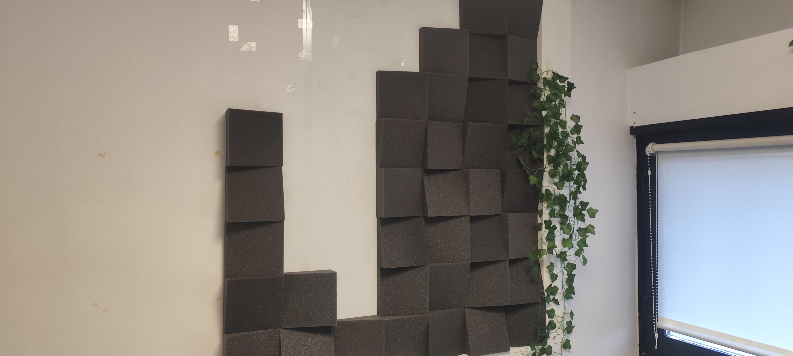
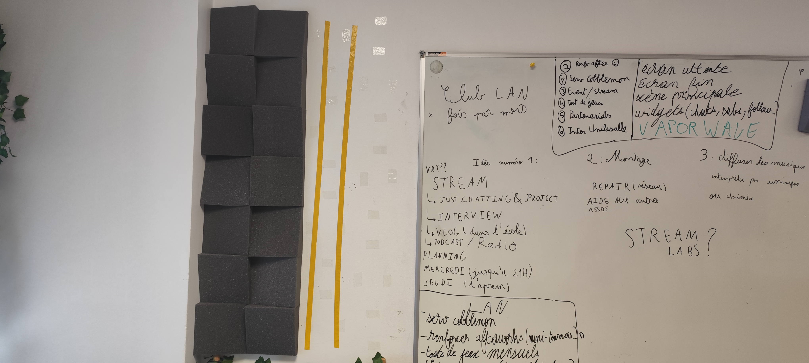
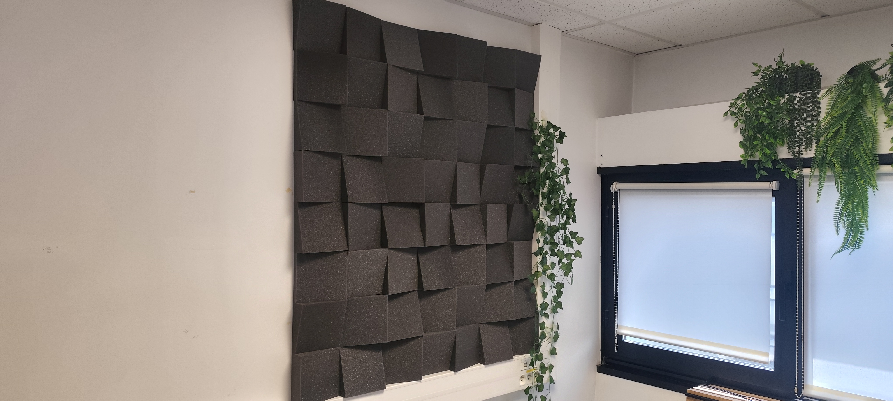

---
layout: default
parent: Projets
nav_order: 2
title: Mousses acoustiques
---

# Réinstallation des mousses acoustiques

## Besoin

Dans le cadre de la préparation d'une visite du [Makerspace](../Explication/Definitions.md#makerspace), il était nécessaire de remettre en place les mousses acoustiques présentes dans la salle du MediaLab. 

Ces mousses avaient tendance à tomber à cause de la chaleur, ce qui gêner utilisation de la salle.

## But du projet

Le but était de remettre les mousses acoustiques en place et de trouver une solution permettant de les maintenir correctement sur le mur.

## Réinstallation

Nous avons commencé par remettre les mousses sur les murs à l'aide de [scotch double face](../Explication/Definitions.md#scotch-double-face).

Cette solution permettait de fixer les mousses sans réaliser de modification importante du mur.

*Mousse manquante*

*Solution pour installer la mousse

*Mousse installer*

## Problème rencontré

Après quelque temps, les mousses sont de nouveau tombées à cause de la chaleur.

Nous avons donc essayé d'utiliser davantage de [scotch double face](../Explication/Definitions.md#scotch-double-face) afin d'améliorer leur maintien.

Cependant, cette solution n'a pas été suffisante. Les mousses sont une nouvelle fois tombées.

*Mousse au sol suite à la chaleur*

## Solution

Face à ce problème, nous avons finalement retiré toutes les mousses ainsi que le scotch présent sur le mur.

Cette expérience a montré que la solution utilisée ne permettait pas de maintenir durablement les mousses dans les conditions présentes dans la salle.

## Résultat

La remise en place des mousses a permis de tester une première solution de fixation, mais celle-ci n'a pas résisté aux conditions de la salle.

Ce projet m'a surtout permis de comprendre qu'une solution doit être testée dans les conditions réelles d'utilisation et qu'il faut parfois revenir sur une première solution lorsqu'elle ne fonctionne pas.