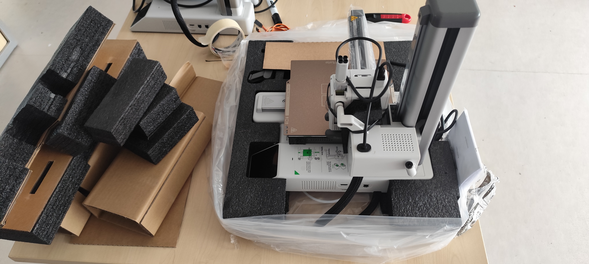
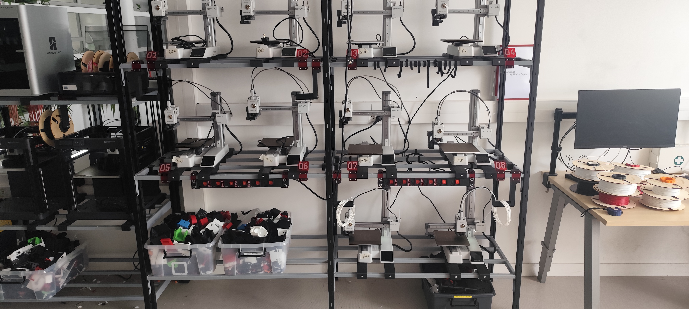

---
layout: default
parent: Projets
nav_order: 3
title: Installation des nouvelles imprimantes
---

# Réhaussement des armoires et installation des nouvelles imprimantes

## Besoin

Le [Makerspace](../Explication/Definitions.md#makerspace) devait installer 2 nouvelles [imprimantes 3D](../Explication/Definitions.md#imprimante-3d) dans la salle dédiée aux imprimantes.

Ces deux nouvelles imprimantes étaient nécessaires car, pendant les périodes de projets, les étudiants devaient parfois attendre qu'une imprimante se libère pour pouvoir imprimer leur travail : certaines machines étaient utilisées pour les projets liés aux cours, tandis que d'autres étaient occupées par des projets personnels ou par les projets de l'association UniMakers.

L'espace disponible devait donc être optimisé afin de pouvoir ajouter les nouvelles machines sans perdre l'espace de rangement existant.

Il fallait également adapter l'organisation autour des imprimantes afin de pouvoir stocker les bobines, les étiquettes et les déchets produits pendant les impressions.

## But du projet

Le but était de réorganiser les armoires afin d'accueillir les nouvelles imprimantes et de créer ou réutiliser les différents accessoires nécessaires à leur utilisation.

Cela comprenait notamment les portes-bobines, les porte-étiquettes et une nouvelle boîte permettant de récupérer les déchets produits par les imprimantes.

## Installation des nouvelles imprimantes

Nous avons commencé par réfléchir à la manière de créer un nouvel étage sur les armoires afin de pouvoir installer deux nouvelles [Bambu Lab A1 Mini](../Explication/Definitions.md#bambu-lab-a1-mini).

L'objectif était de conserver une organisation stable tout en utilisant au maximum la hauteur disponible.

Les [supports](../Explication/Definitions.md#supports) déjà existants nécessaires aux imprimantes devaient également être réimprimés.

*Imprimante dans leurs boites*

Donc, on a dû rehausser les armoires et faire le câble management. On l’a fait deux fois, car la première fois on s’était trompé de quelques centimètres, les personnes trop petites ne pouvaient pas accéder au plateau. On a aussi installés les imprimantes montés.

*L'armoire réhausser*

## Création des portes-bobines et portes-étiquettes 

Nous avons ensuite utilisé le modèle des portes-bobines et des portes-étiquettes  déjà existant afin de pouvoir stocker les bobines de [filament](../Explication/Definitions.md#filament) à proximité des imprimantes.

*Portes-bobines imprimés.*

*Porte-étiquettes imprimés.*

Certaines pièces ont été imprimées en 3D et assemblées avec des pièces fabriquées à l'aide d'une [découpeuse laser](../Explication/Definitions.md#decoupeuse-laser).

Pour assembler les pièces imprimées, nous avons utilisé une machine fonctionnant sur un principe similaire à un fer à souder afin d'insérer des [inserts](../Explication/Definitions.md#insert) métalliques.

Un [insert](../Explication/Definitions.md#insert) permet ensuite de visser une pièce dans le plastique et d'obtenir un assemblage plus solide.

<video src="../images/semaine6/VID_insert.mp4" controls muted>
</video>
*Mise en place d'un insert dans une pièce imprimée en 3D.*

*Toutes les piéces avec un insert*

Raphaël a ensuite utilisé la [découpeuse laser](../Explication/Definitions.md#decoupeuse-laser) afin de fabriquer les pièces nécessaires à l'accrochage des portes-bobines.

Raphaël a aussi fait le montage des portes-bobines :

<video src="../images/semaine6/VID_montage.mp4" controls muted>
</video>

Ensuite j'ai monté les portes-étiquettes et les portes-bobines 

*Installation des portes-bobines et portes-étiquettes dans le Makerspace.*

## Conception de la boîte à déchets

Une autre partie importante du projet a été la conception d'une nouvelle boîte destinée à récupérer les déchets produits par les imprimantes.

La boîte existante était trop petite et devait être vidée régulièrement.

La problématique était donc de concevoir une boîte plus grande afin de réduire la fréquence de vidage.

## Recherche de solutions

J'ai réfléchi à plusieurs solutions pour augmenter la capacité de la boîte.

Une première possibilité consistait à rendre la boîte plus profonde. Cependant, les imprimantes situées sous la boîte empêchaient cette solution.

J'ai également envisagé de rendre la boîte plus large, mais les dimensions du plateau des imprimantes limitaient cette possibilité.

Une autre idée consistait à créer des rampes permettant de guider tous les déchets vers le même endroit. Cependant, les câbles et les [buses](../Explication/Definitions.md#buse) des imprimantes gênaient cette solution.

L'espace disponible sur la partie gauche de l'armoire était également insuffisant pour réaliser cette solution.

## Conception sur Onshape

Pour concevoir la nouvelle boîte, j'ai utilisé [Onshape](../Explication/Definitions.md#onshape).

J'ai commencé par reprendre les dimensions de l'ancienne boîte afin qu'elle puisse toujours s'emboîter sur les barres métalliques de l'armoire.

*Relevé des dimensions nécessaires à la conception.*

J'ai ensuite créé une première [esquisse](../Explication/Definitions.md#esquisse) composée de deux rectangles. J'ai utilisé une [extrusion](../Explication/Definitions.md#extrusion) afin d'ajouter de la matière entre les deux rectangles.

*Première esquisse utilisée pour commencer la conception de la boîte.*

Cette méthode m'a permis de créer directement des bords d'environ 1 cm d'épaisseur.

J'ai ensuite réalisé une deuxième [esquisse](../Explication/Definitions.md#esquisse) afin de laisser suffisamment d'espace autour de la [buse](../Explication/Definitions.md#buse) pour que les déchets puissent tomber dans la boîte sans être gênés.

*Conception de la zone permettant aux déchets de tomber dans la boîte.*

Des [congés](../Explication/Definitions.md#conge) ont ensuite été ajoutés sur les bords afin d'éviter d'avoir des angles trop pointus.

*Arrondissement des bords extérieurs de la boîte.*

Après cela, j'ai réalisé une [extrusion](../Explication/Definitions.md#extrusion) permettant de créer le fond de la boîte.

*Création du fond de la boîte.*

J'ai ensuite réalisé une nouvelle [esquisse](../Explication/Definitions.md#esquisse) en prenant en compte la distance entre les barres de l'étagère. Cette étape m'a permis d'agrandir la boîte vers le bas afin d'augmenter sa capacité tout en conservant son système de fixation.

*Prise en compte des dimensions réelles de l'étagère.*

Enfin, j'ai réalisé une [extrusion](../Explication/Definitions.md#extrusion) en enlèvement de matière afin d'augmenter le volume disponible à l'intérieur de la boîte. J'ai également ajouté deux congés à l'intérieur afin d'arrondir les angles et de faciliter la chute des déchets vers le fond.

*Conception de l'intérieur de la boîte à déchets.*

## Prise en compte des contraintes réelles

Après une discussion avec Alban, j'ai appris qu'il était préférable de reproduire directement les contraintes réelles dans [Onshape](../Explication/Definitions.md#onshape).

J'ai donc modélisé les barres métalliques de l'étagère afin de pouvoir concevoir la boîte directement autour de ces contraintes.

Cette méthode permettait de vérifier directement si la pièce pouvait réellement être installée sur l'étagère.

*Reproduction des contraintes réelles de l'étagère dans Onshape.*

## Impression avec un angle de 45°

Une première difficulté venait de la taille du plateau d'impression.

En position verticale, la boîte nécessitait des [supports](../Explication/Definitions.md#supports) qui auraient été difficiles à retirer et qui auraient pu dégrader la pièce.

J'ai donc étudié la possibilité d'imprimer la boîte avec un angle de 45°.

Cette orientation permettait à la fois d'utiliser plus efficacement le plateau et de limiter les besoins en [supports](../Explication/Definitions.md#supports).

Cependant, la pièce était encore trop grande pour être imprimée en une seule fois.

*Partie de la boîte dépassant du plateau d'impression.*

J'ai donc séparé la boîte en deux parties et créé un système d'[encoche](../Explication/Definitions.md#encoche) permettant de les assembler.

## Dernière adaptation

Après avoir séparé la boîte, un nouveau problème est apparu. Pour que la boîte puisse correctement s'accrocher aux barres de l'étagère, une partie devait conserver un angle de 45°.

Cependant, cette géométrie créait des zones nécessitant des [supports](../Explication/Definitions.md#supports).

*Zone de la boîte nécessitant des supports*

J'ai donc modifié la conception afin de conserver une petite partie à 90° qui nécessiterait des [supports](../Explication/Definitions.md#supports) mais permettrait à la boîte de se bloquer correctement sur les barres.

L'autre partie a été courbée afin de respecter l'angle de 45° sans nécessiter de [supports](../Explication/Definitions.md#supports).

Cette conception a finalement été validée par Alban.

*Version finale de la boîte à déchets avec la partie nécessitant des supports et la partie inclinée.*

## Lancement de l'impression

J'ai ensuite lancé l'impression de la boîte.

L'impression devait durer environ sept heures. Comme mon stage se terminait à ce moment-là, je n'ai pas pu observer directement le résultat final.

## Résultat

Ce projet m'a permis de concevoir une pièce en prenant en compte les contraintes réelles d'une installation existante.

J'ai également appris à rechercher différentes orientations d'impression afin de limiter les [supports](../Explication/Definitions.md#supports) et à adapter une pièce aux dimensions du plateau.

Cette mission m'a permis de découvrir une approche plus avancée de la conception pour l'[impression 3D](../Explication/Definitions.md#impression-3d).

*L'armoire *