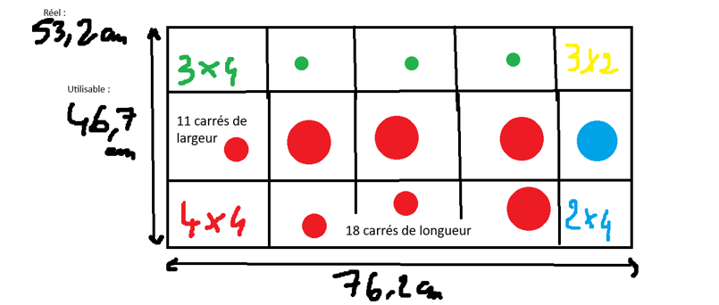
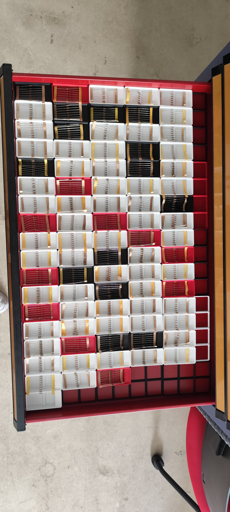
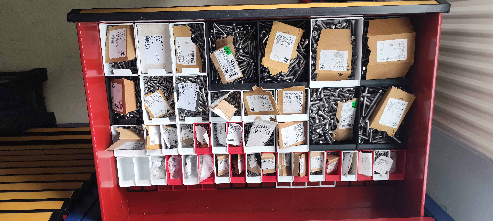

---
layout: default
parent: Projets
nav_order: 1
title: Réorganisation de la zone de stockage
---

# Réorganisation de la zone de stockage

## Besoin

La zone de stockage du Makerspace était difficile à utiliser car le matériel n'était pas toujours rangé à un emplacement précis. Certains objets étaient éparpillés, certaines armoires contenaient du matériel qui n'était plus utilisé et plusieurs composants n'étaient pas rangés dans la salle où ils étaient réellement utilisés.

Le rangement des petites pièces, notamment des vis, des écrous et des résistances électroniques, devait également être amélioré afin de pouvoir retrouver rapidement un composant.

## But du projet

Le but était de rendre la zone de stockage plus organisée et plus facile à utiliser. L'objectif était notamment de donner un emplacement précis aux différents objets et de mettre en place un système permettant de retrouver rapidement les composants.

Une partie importante du projet consistait à utiliser le système [Gridfinity](../Explication/Definitions.md#gridfinity) afin de créer des rangements adaptés aux tiroirs existants.

## Réorganisation générale

J'ai commencé par observer les différentes salles et les problèmes de rangement présents dans chacune d'elles.

Dans la salle de stockage j'ai proposé de mettre des étiquettes à l'endroit où chaque objet doit être rangé. Une autre idée était d'utiliser des images avec différentes couleurs pour identifier les différents niveaux des armoires mais je n'est la pas mis en place car les étiquettes servait déjà à palier à ce problème.

Les petites pièces devaient être regroupées dans des boîtes afin d'éviter qu'elles soient mélangées ou éparpillées.

## Nettoyage et tri

Une partie du travail a consisté à retirer du matériel qui n'était plus utile.

Dans une armoire de rangement, nous avons notamment retiré des cartes électroniques inutilisées, des câbles ainsi que des robots et des télécommandes qui n'avaient plus d'utilité.

Cette étape permettait de libérer de l'espace et de mieux utiliser les capacités de stockage disponibles.

Les cartons et emballages inutiles ont également été regroupés afin de garder la zone de stockage propre.

## Déplacement du matériel

J'ai également participé au déplacement de matériel entre différentes salles.

La servante provenant du Resin Lab devait être déplacée dans la zone de stockage. Cette servante contenait notamment des tiroirs permettant de ranger différentes petites pièces. Elle contenait aussi les résistances du makerspace.

## Mise en place de Gridfinity

Pour améliorer le rangement des petites pièces, j’ai utilisé le système [Gridfinity](../Explication/Definitions.md#gridfinity). Plusieurs solutions étaient envisageables, mais [Gridfinity](../Explication/Definitions.md#gridfinity) reste le système le plus rentable. On aurait pu commander des armoires sur mesure, mais cela aurait coûté très cher. Comme nous sommes dans un makerspace et que nous avons la chance d’avoir une salle d’impression 3D, autant l’utiliser ! Cela nous permet de mettre à profit les imprimantes et le matériel que nous possédons déjà pour équiper la servante.

J'ai commencé par prendre les dimensions du tiroir destiné aux vis et aux écrous. Le tiroir mesurait 76,2 cm de longueur, 53,5 cm de largeur et environ 9,8 cm de hauteur.

Cependant, toute la surface du tiroir ne pouvait pas être utilisée. Une partie devait rester libre afin de pouvoir relever les bacs à vis sans qu'ils soient gênés.

La surface réellement utilisable était donc de 76,2 cm par 46,7 cm.

Avec les dimensions du système Gridfinity, un carré correspond à environ 4,2 cm. J'ai donc calculé que le tiroir pouvait accueillir une grille de 18 carrés sur la longueur et 11 carrés sur la largeur utilisable.

## Adaptation aux capacités de l'imprimante

La grille devait être imprimée avec une Bambu Lab A1 Mini. Son plateau étant relativement petit, je ne pouvais pas imprimer toute la grille en une seule pièce.

J'ai donc divisé la grille en plusieurs parties compatibles avec la taille du plateau.

La grille était composée de plusieurs éléments de différentes tailles :

- 8 éléments de 4 × 4 ;
- 4 éléments de 3 × 4 ;
- 2 éléments de 2 × 4 ;
- 1 élément de 2 × 3.

J'ai préparé les fichiers avec [OrcaSlicer](../Explication/Definitions.md#orcaslicer), puis lancé plusieurs impressions afin de produire l'ensemble des éléments.

## Création des boîtes

Une fois les grilles terminées, j'ai commencé à tester différentes hauteurs de boîtes.

J'ai notamment comparé les hauteurs 1U, 4U et 8U. J'ai finalement choisi la hauteur 8U pour les grandes boîtes car elle permettait de stocker une grande quantité de vis tout en laissant la possibilité de placer d'autres bacs au-dessus sans empêcher le tiroir de se fermer.

J'ai ensuite imprimé les boîtes nécessaires pour ranger les différentes vis et les écrous.

Pour les grandes quantités de composants, j'ai utilisé la Bambu Lab P1P et la Bambu Lab X1 Carbon afin d'augmenter la vitesse de production.

## Étiquetage et logique de rangement

Une fois les boîtes imprimées, les vis et les écrous ont été répartis dans les différents bacs.

Les boîtes ont ensuite été étiquetées afin que l'utilisateur puisse rapidement identifier leur contenu.

L'objectif final est que chaque type de composant possède un emplacement précis et que l'utilisateur puisse comprendre facilement où retrouver le matériel.

## Résultat

Cette organisation a permis de transformer progressivement les tiroirs en un système de rangement structuré.

Les grilles Gridfinity permettent de maintenir les boîtes en place tandis que les étiquettes permettent d'identifier leur contenu.

Le projet a également permis de commencer à mettre en place une logique plus générale pour la zone de stockage : chaque objet doit avoir un emplacement défini et les pièces doivent être regroupées dans des contenants adaptés.

*résultat sur les résistances*

*résultat sur les résistances*

## Compétences développées

Ce projet m'a permis de développer mes compétences en organisation, en prise de mesures, en conception de rangement et en impression 3D.

J'ai également appris à adapter une conception aux contraintes physiques d'un espace et aux dimensions du plateau d'une imprimante.

