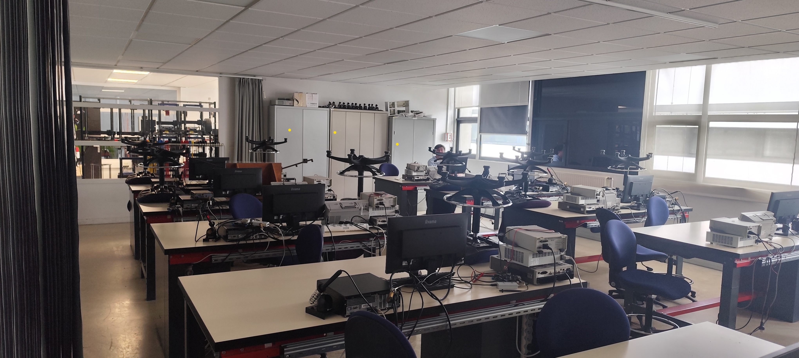
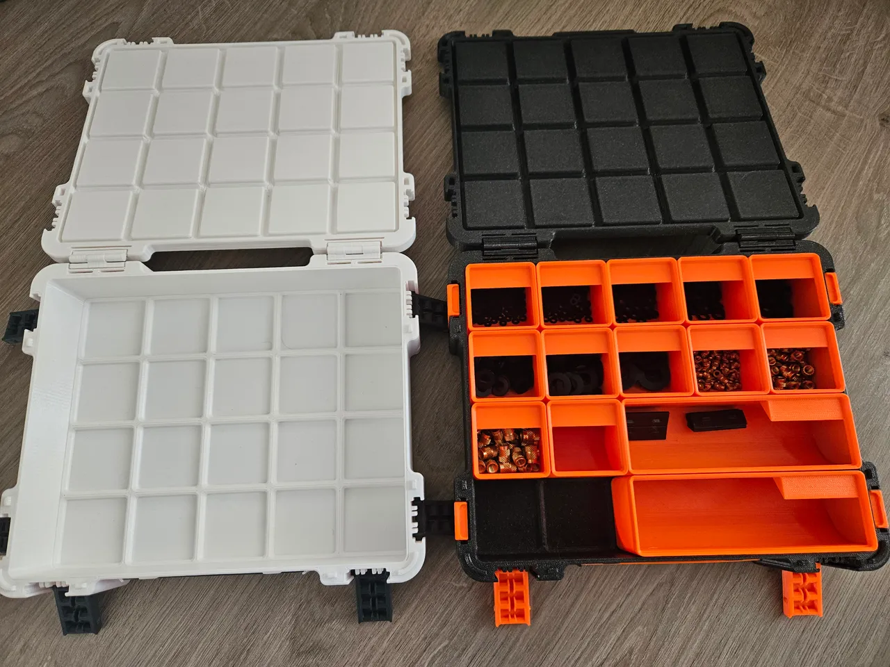
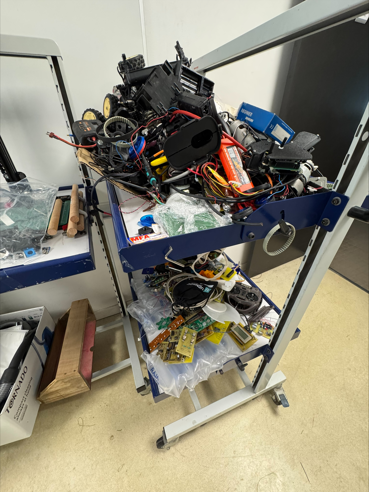
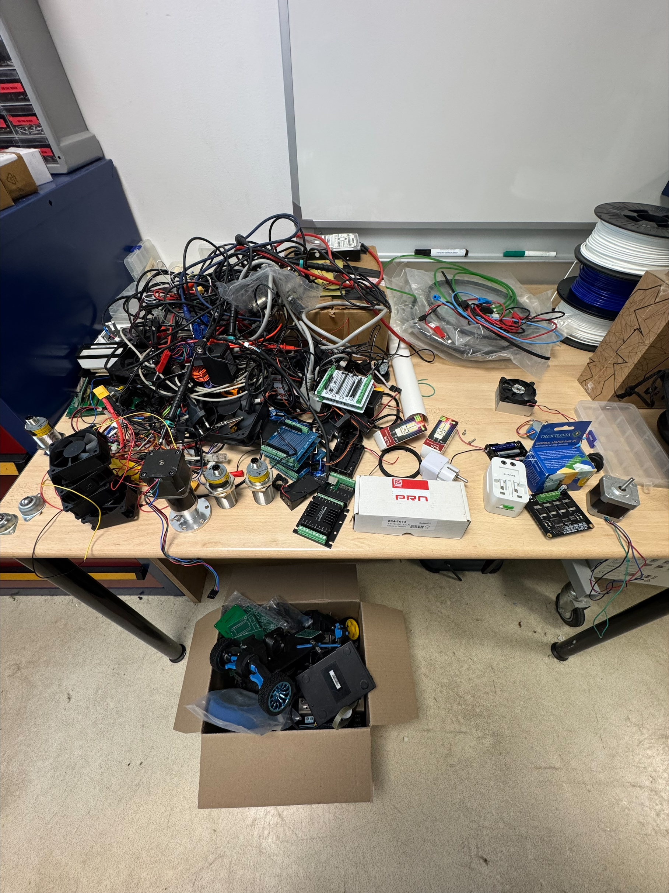
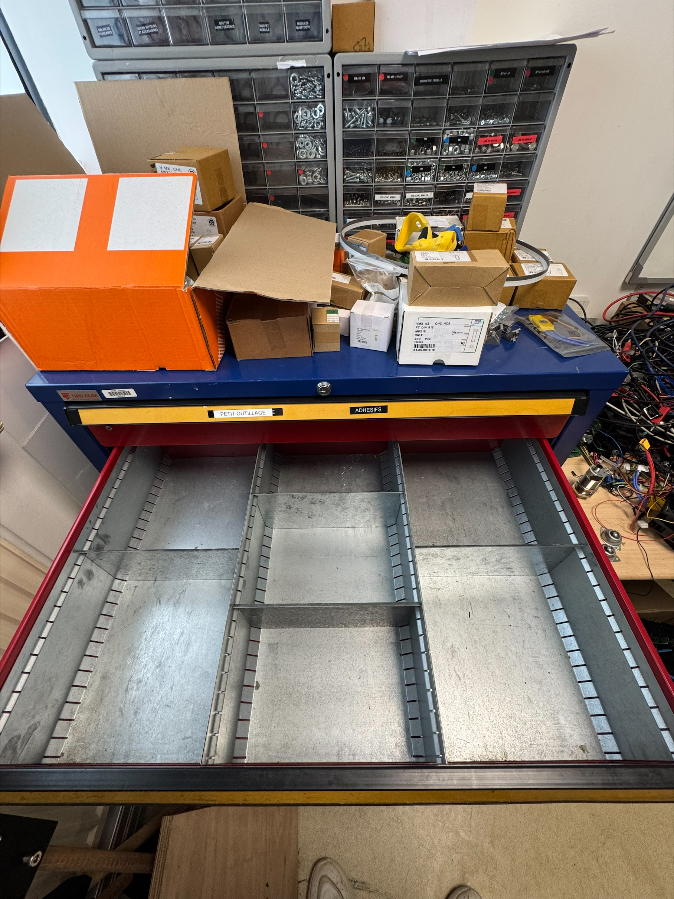
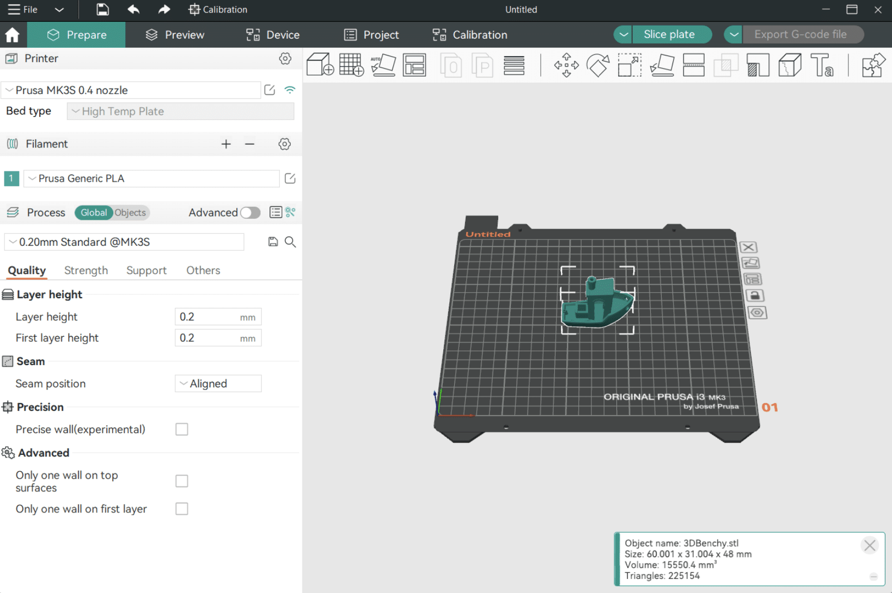
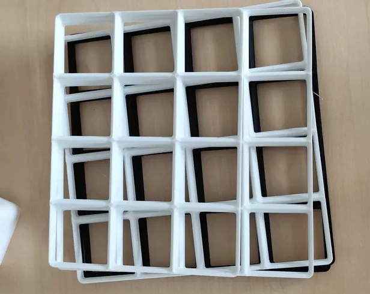
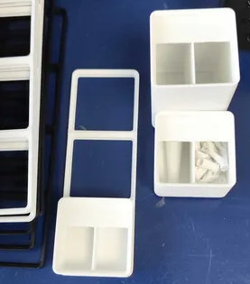

---

layout: default
title: semaine 1
parent: Documentation continue
nav_order: 1
---

# Semaine 1 – Découverte du Makerspace et mise en place d'un système de rangement Gridfinity

## Introduction de la semaine

Cette première semaine de stage a été consacrée à la découverte du Makerspace, à l'analyse de l'organisation des différents espaces et à la mise en place d'un projet d'amélioration du rangement. Une grande partie du travail a porté sur la préparation d'un système de stockage modulaire basé sur [Gridfinity](../Explication/Definitions.md#gridfinity) afin d'optimiser le rangement des vis et des petites pièces.

---

# Jour 1 - Pas de travail 

Nous avons commencé le stage un mardi et pour la documentation pour que sa soit plus simple j'ai numéroté à partir de notre semaine de début (jour 1 = lundi, jour 2 = mardi etc..)

# Jour 2 – Observation et analyse des espaces et découverte de Gridfinity et tri du matériel

Pour cette première journée, ma mission consistait à observer les différentes salles du Makerspace afin d'identifier les problèmes de rangement et de proposer des solutions d'amélioration.

Dans la salle résine, j'ai remarqué que plusieurs objets n'avaient pas d'emplacement clairement défini. Cela peut entraîner une perte de temps lors des recherches de matériel et rendre le rangement plus difficile. J'ai donc proposé la mise en place d'étiquettes ou de zones dédiées afin que chaque objet dispose d'une place précise. J'ai également constaté qu'un rappel plus visible des règles de sécurité pourrait être bénéfique pour les utilisateurs.

*Salle résine*

J'ai ensuite étudié la nouvelle salle de stockage. Plusieurs pistes d'amélioration ont été identifiées. Certains objets lourds étaient placés en hauteur dans les armoires, ce qui présente un risque de chute. Une réorganisation du stockage pourrait permettre de placer les éléments les plus volumineux sur les étagères basses et les plus légers sur les étagères supérieures. J'ai également proposé d'ajouter des étiquettes ainsi que des photos du contenu des armoires afin de faciliter le rangement du matériel après utilisation.

*Salle de stockage*

D'autres améliorations ont été envisagées, comme l'installation de supports sous certaines tables pour stocker les bobines de [filament](../Explication/Definitions.md#filament) ou encore le déplacement de certains matériaux vers des salles plus adaptées à leur utilisation. Par exemple, les composants électroniques pourraient être regroupés dans le RepairSpace tandis que les planches de bois pourraient être stockées à proximité des découpeuses laser dans l'OpenLab.

J'ai également visité la salle de bureau et la salle destinée à devenir un futur espace de travail. Dans cette dernière, j'ai constaté que l'agencement actuel rendait difficile la circulation d'une personne en fauteuil roulant. Une réorganisation de l'espace sera nécessaire afin de conserver un accès conforme aux besoins des personnes à mobilité réduite et des services de secours.

*Futur espace de travail*

Enfin, une réflexion a été menée sur la gestion du stock. Une solution intéressante serait l'installation d'une tablette permettant d'enregistrer les emprunts de matériel, de signaler les composants manquants et de suivre plus facilement l'état des stocks.

Lors de cette deuxième journée, j'ai découvert le système de rangement modulaire [Gridfinity](../Explication/Definitions.md#gridfinity), très utilisé en [impression 3D](../Explication/Definitions.md#impression-3d). Son principe repose sur une grille standardisée permettant de créer des bacs de différentes tailles qui s'emboîtent parfaitement dans des tiroirs ou des espaces de stockage.

J'ai commencé à rechercher différents modèles disponibles en ligne afin de comprendre le fonctionnement du système et d'identifier les pièces qui pourraient être utiles pour le projet.

*Gridfinity*

Une partie de la journée a également été consacrée au tri du matériel présent dans une armoire de stockage. Avec des étudiants, nous avons retiré plusieurs objets devenus inutiles, notamment d'anciennes cartes électroniques, des câbles qui n'étaient plus utilisés ainsi que du matériel obsolète. Cette opération a permis de libérer de l'espace et de préparer l'installation future de nouvelles solutions de rangement.

  
  
  

# Jour 3 – Préparation du projet Gridfinity

Cette journée a été consacrée à la préparation du système de rangement destiné à un tiroir de stockage.

J'ai commencé par rechercher différents modèles de bacs et de tiroirs compatibles avec [Gridfinity](../Explication/Definitions.md#gridfinity). Ces recherches m'ont permis de découvrir de nombreuses variantes adaptées au rangement des vis, des écrous et d'autres petites pièces.

Afin de préparer correctement le projet, j'ai pris les dimensions du tiroir concerné. Les mesures relevées sont les suivantes :

| Dimension      | Valeur  |
| -------------- | ------- |
| Longueur       | 76,2 cm |
| Largeur totale | 53,5 cm |
| Hauteur        | 9,8 cm  |

Après analyse, j'ai constaté que toute la largeur du tiroir n'était pas réellement utilisable. Une partie doit rester libre afin de pouvoir sortir facilement les bacs de rangement. La largeur exploitable est donc de 46,7 cm.

Le système [Gridfinity](../Explication/Definitions.md#gridfinity) étant basé sur des modules de 4,2 cm × 4,2 cm, j'ai effectué les calculs nécessaires afin de déterminer le nombre de cases pouvant être installées dans le tiroir. Le résultat obtenu est une grille de 18 modules de longueur sur 11 modules de largeur. Ce qui fait qu'avec la taille d'impression des imprimates on doit imprimer 8 grilles de 4x4, 4 grilles de 4x3, 2 grilles de 2x4 et 1 grilles de 3x2 

J'ai également installé et configuré [OrcaSlicer](../Explication/Definitions.md#orcaslicer) sur mon ordinateur afin de préparer les futures impressions 3D. Cette étape m'a permis de découvrir les bases du [tranchage (slicing)](../Explication/Definitions.md#tranchage-slicing) de modèles et de la préparation des fichiers destinés aux imprimantes.

*OrcaSlicer*

Au cours de cette journée, j'ai aussi pris connaissance de la documentation disponible pour les machines. Les guides d'utilisation, accessibles grâce à des QR codes placés sur les équipements, constituent une ressource très utile pour apprendre rapidement à utiliser les différents outils du Makerspace.

J'ai enfin pu redécouvrir le parc d'imprimantes 3D du Makerspace, comprenant notamment les [Bambu Lab A1 Mini](../Explication/Imprimante.md#bambu-lab-a1-mini), les [Bambu Lab P1P](../Explication/Imprimante.md#bambu-lab-p1p), la [Bambu Lab X1 Carbon](../Explication/Imprimante.md#bambu-lab-x1-carbon) ainsi que plusieurs [imprimantes Artillery](../Explication/Imprimante.md#imprimantes-artillery). 

# Jour 4 – Impression des grilles et choix des bacs

Après avoir préparé les fichiers nécessaires, j'ai lancé l'impression des différentes plaques constituant le fond du tiroir [Gridfinity](../Explication/Definitions.md#gridfinity).

Une fois toutes les pièces terminées, j'ai pu vérifier leur assemblage dans le tiroir. Les dimensions calculées étaient correctes et l'ensemble s'est parfaitement intégré dans l'espace prévu.

*Grille Gridfinity*

J'ai ensuite réalisé plusieurs essais afin de déterminer la hauteur de bacs la plus adaptée aux besoins du Makerspace. Différentes tailles standard ont été testées afin de comparer leur capacité de rangement et leur facilité d'utilisation.

À l'issue de ces essais, j'ai choisi d'utiliser des bacs de hauteur 8U. Cette solution offre un bon compromis entre capacité de stockage et modularité. Elle permet notamment de stocker une quantité importante de vis tout en conservant suffisamment d'espace pour ajouter d'autres bacs au-dessus sans empêcher la fermeture du tiroir.

# Jours 5 à 7 – Impression des bacs de rangement

Les jours suivants ont été principalement consacrés à l'impression des différents bacs qui composeront le futur système de rangement.

Les impressions se sont déroulées sans difficulté particulière et ont permis de produire progressivement l'ensemble des éléments nécessaires au projet. Cette phase m'a permis de me familiariser davantage avec le fonctionnement des imprimantes 3D ainsi qu'avec la gestion de séries d'impressions sur plusieurs jours.

Au fur et à mesure de l'avancement, il a été possible de visualiser l'organisation future du tiroir et de vérifier que les dimensions choisies répondaient bien aux besoins de stockage des vis et des petites pièces.

*Bacs Gridfinity imprimés*

---

# Bilan de la semaine

Cette première semaine m'a permis de découvrir le fonctionnement général du Makerspace ainsi que les différents espaces qui le composent. J'ai participé à l'analyse de plusieurs problématiques de rangement et proposé différentes pistes d'amélioration visant à rendre les espaces plus pratiques et plus sécurisés.

J'ai également découvert le système [Gridfinity](../Explication/Definitions.md#gridfinity), appris à utiliser [OrcaSlicer](../Explication/Definitions.md#orcaslicer) et réalisé mes premières impressions dans le cadre d'un projet concret. Les différents tests effectués ont permis de valider la conception du futur système de rangement, dont la mise en place se poursuivra au cours des prochaines semaines.

