# Semaine 4 – Finalisation du premier tiroir et lancement de nouveaux projets

## Introduction de la semaine

Cette semaine a été principalement consacrée à l'amélioration de l'organisation du Makerspace ainsi qu'au développement de mon site de documentation. J'ai poursuivi la réalisation des tiroirs de rangement pour les vis et les résistances en imprimant les différentes boîtes et grilles nécessaires. En parallèle, j'ai corrigé plusieurs problèmes sur le site web et mis en place un environnement de développement local avec [Jekyll](../Explication/Definitions/#jekyll) afin de pouvoir tester mes modifications avant leur mise en ligne. J'ai également participé à différentes tâches annexes, comme le rangement d'une salle, des échanges autour de l'impression 3D ou encore l'accompagnement d'un nouveau stagiaire.

---

# Jour 15 : Correction de bugs sur le site

Aujourd’hui, j’ai corrigé un problème sur le site web. Certaines balises redirigeaient vers les mauvaises pages lorsqu’on cliquait dessus. J’ai donc vérifié les liens et corrigé ceux qui étaient mal configurés afin que chaque balise mène bien vers la page correspondante.

Nous avons également fait un point avec mon maître de stage sur le travail réalisé durant la semaine. Cela a permis de faire le bilan des tâches terminées et de préparer celles à venir.

Pour la semaine prochaine, nous devrons commencer à réfléchir à une solution concernant les ordinateurs qui rencontrent régulièrement des problèmes.

# Jour 16 : Impression multicolore et rangement des vis

Je me suis renseigné sur les possibilités d’impression multicolore avec les imprimantes disponibles au Makerspace. Je voulais savoir s’il était possible de mélanger plusieurs couleurs comme en peinture afin d’obtenir de nouvelles teintes. J’ai appris que ce n’était pas possible avec les machines dont nous disposons. En revanche, certaines imprimantes peuvent utiliser plusieurs filaments de couleurs différentes au cours d’une même impression.

La [Bambu Lab X1 Carbon](../Explication/Imprimante/#bambu-lab-x1-carbon) du Makerspace possède notamment un système [AMS](../Explication/Definitions/#ams) (*Automatic Material System*) qui permet d’utiliser jusqu’à quatre couleurs différentes. Grâce à ce système, il est possible de réaliser des dégradés de couleurs, mais pas de mélanger directement les couleurs comme on le ferait avec de la peinture.

Au cours de la journée, nous avons rencontré un petit problème avec l’étiqueteuse qui n’avait plus de papier. Nous avons donc dû utiliser une autre machine afin de continuer le travail.

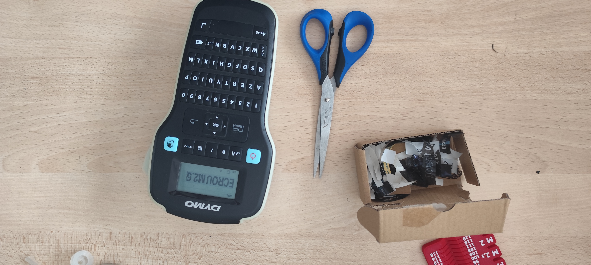
*Figure 1 : Changement d'étiqueteuse*

J’ai ensuite poursuivi le rangement des vis dans les nouvelles boîtes. La méthode utilisée est assez simple : je récupère les informations présentes sur l’emballage d’origine, je place les vis dans la nouvelle boîte, puis je conserve les informations concernant les dimensions. Ensuite, à l’aide de l’étiqueteuse, je recrée une étiquette propre qui est collée sur la boîte afin de pouvoir identifier facilement son contenu.

Un imprévu est apparu dans l’organisation. Les jours précédents, j’avais imprimé suffisamment de boîtes pour ranger toutes les vis, mais certaines ont été utilisées par d’autres personnes pour d’autres besoins. J’ai donc dû prévoir la réimpression de deux boîtes de dimensions **2×1×8** afin de terminer le premier tiroir.

Nous avons réussi à ranger toutes les vis du premier tiroir dans leurs boîtes respectives. Il ne reste désormais plus qu’à imprimer les deux boîtes manquantes et à terminer l’étiquetage.

Avant de terminer la journée, j’ai également nettoyé la zone de travail. Les cartons vides avaient été laissés à côté des établis, je les ai regroupés dans un sac afin de les jeter plus tard et garder un espace plus propre.

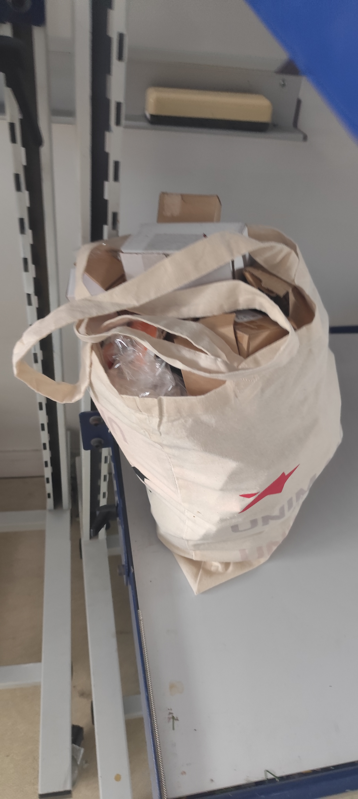

*Figure 2 : Cartons rangés dans un sac*

# Jour 17 : Nouvelle mission

Ce matin, j’ai installé [Jekyll](../Explication/Definitions/#jekyll) sur mon ordinateur. Cet outil permet de lancer une version locale du site web afin de visualiser les modifications avant de les envoyer sur GitHub. Cela évite de publier des changements qui pourraient provoquer des erreurs sur le site en ligne. Je peux donc tester chaque modification en temps réel tout en conservant une version stable du site accessible aux utilisateurs.

J’ai ensuite reçu une nouvelle mission : créer une grille [Gridfinity](../Explication/Definitions/#gridfinity) adaptée à un tiroir moins haut afin de ranger des résistances. Cette mission va me demander de concevoir les boîtes et les grilles nécessaires pour organiser correctement les différents composants.

Une partie de la matinée a également été consacrée au rangement d’une salle qui va prochainement être réaménagée. Les oscilloscopes et le matériel pouvant être déplacé ont été rangés dans une armoire située dans une autre salle. Nous avons également déplacé les chaises dans le couloir et débranché tous les équipements avant leur déplacement.

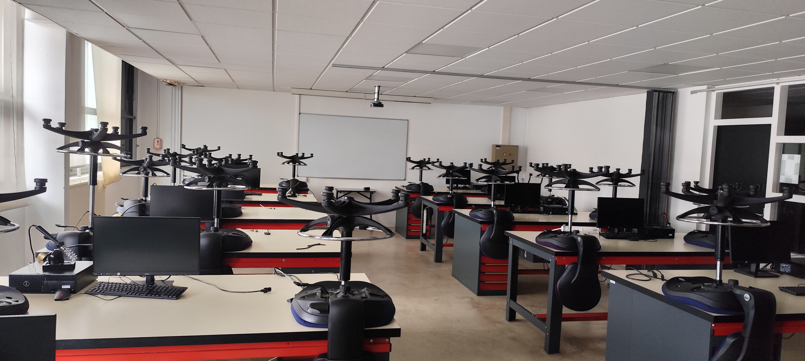
*Figure 3 : Salle avant le rangement*

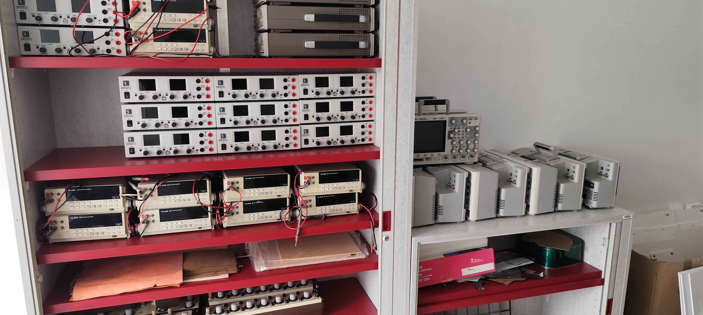
*Figure 4 : Matériel déplacé dans une amoire*

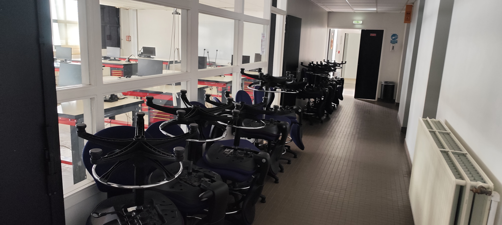
*Figure 5 : Déplacement des chaises dans le couloir*

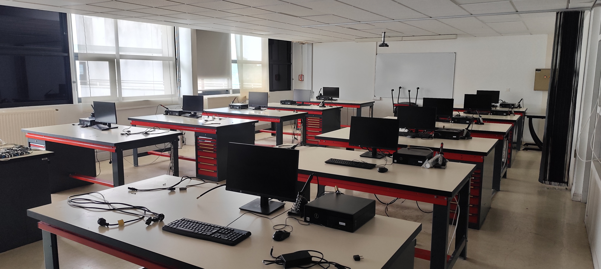
*Figure 6 : Salle après rangment*

Ce déplacement de matériel avait pour but de préparer la nouvelle salle du makerspace. L'ancienne salle était mal agancé et avait besoin d'être réogarnisé. Ce déplacement de matérielle permettra de faciliter l'instalation des nouvelles tables. 

Dans l’après-midi, j’ai lancé l’impression des deux boîtes qui me manquaient pour terminer le premier tiroir à vis. J’ai également commencé à imprimer les boîtes destinées au tiroir des résistances. J’ai lancé six impressions de boîtes **2×1×2**, contenant chacune trois boîtes, ce qui représente un total de 18 boîtes. À terme, il faudra fabriquer 84 boîtes afin de pouvoir stocker les 84 valeurs de résistances différentes.

J’ai aussi discuté avec Adrien et Alban à propos de l’impression 3D multicolore et des imprimantes résine. J’ai appris que l’impression multicolore génère beaucoup de déchets, car l’imprimante doit purger l’ancien filament à chaque changement de couleur. Certaines machines utilisent cependant une tour de purge qui permet de limiter les pertes et d’améliorer la qualité des impressions. Ils m’ont également expliqué qu’il était possible de créer l’illusion de nouvelles couleurs en alternant de très fines couches de différentes couleurs, un principe similaire à celui utilisé en imprimerie.

Enfin, nous avons accueilli un nouveau stagiaire. Nous lui avons présenté GitHub ainsi que la procédure permettant de créer un portfolio afin qu’il puisse commencer à documenter son travail.

# Jour 18 : Impression des boîtes pour les résistances

La journée a principalement été consacrée à l’impression des boîtes destinées au tiroir des résistances. J’ai lancé l’impression de 56 boîtes au total sur plusieurs imprimantes [Bambu Lab A1 Mini](../Explication/Imprimante/#bambu-lab-a1-mini). En parallèle, j’ai également imprimé six grilles **4×4** qui serviront de base pour organiser le futur tiroir.

Au cours des impressions, j’ai rencontré plusieurs problèmes techniques. Sur une [Bambu Lab P1P](../Explication/Imprimante/#bambu-lab-p1p), l’impression a échoué car le plateau était sale et le filament n’adhérait plus correctement à la surface.

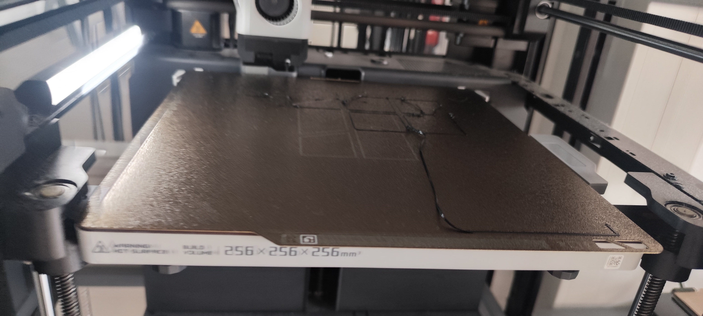
*Figure 7 : erreur sur le plateau*

Une autre pièce a présenté un léger défaut d’impression dû à un problème d’adhérence. Le défaut n’étant pas gênant pour son utilisation finale, j’ai décidé de laisser l’impression se terminer. Une fois la pièce terminée, j’ai utilisé un [ébavureur](../Explication/Definitions/#ebavureur) afin de retirer les petits morceaux de plastique qui dépassaient.

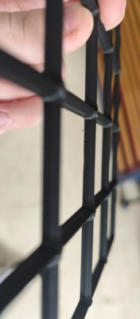
*Figure 8 : Pièce en 3d après l'utilisation d'un ébavureur*

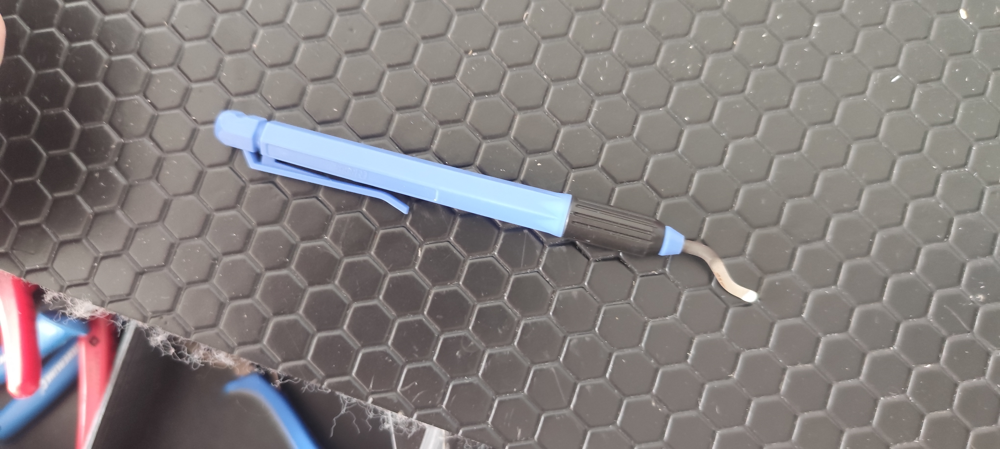
*Figure 9 : Ébavureur* 

Sur les 56 boîtes prévues, seules 48 ont finalement pu être imprimées. Huit boîtes ont été perdues car le plastique refroidissait trop rapidement, ce qui a provoqué une déformation de la pièce. Comme les impressions sont réalisées couche par couche, le défaut s’est amplifié au fil du temps jusqu’à rendre l’impression inutilisable. Pour éviter ce problème lors des prochaines séries, il faudra utiliser de la colle sur le plateau afin d’améliorer l’adhérence.

À la fin de la journée, il me restait encore une vingtaine de boîtes à produire pour terminer complètement le tiroir des résistances.

J’ai également profité du temps restant pour imprimer deux grilles **2×4** supplémentaires destinées au système de rangement.

# Jour 19 : Fin des boîtes de résistances et préparation du deuxième tiroir

Aujourd’hui, j’ai terminé l’impression des boîtes destinées aux résistances en fabriquant les 18 dernières boîtes au format **2×1**. Toutes les boîtes nécessaires sont maintenant disponibles. Il ne reste plus qu’à définir une logique de rangement claire et à réaliser l’étiquetage.

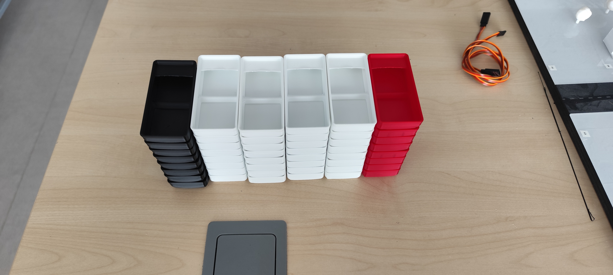
*Figure 10 : Toutes les boites de resistances* 

J’ai également terminé l’impression de la grille du tiroir des résistances avec les dernières pièces nécessaires. La grille est maintenant complète et prête à recevoir les boîtes.

Ensuite, j’ai commencé à préparer le deuxième tiroir destiné aux vis. J’ai imprimé plusieurs nouvelles grilles afin de compléter le fond du tiroir. J’avais déjà quatre grilles **4×4**, j’en ai donc réimprimé quatre supplémentaires ainsi que deux grilles **2×4** et deux grilles **3×4**.

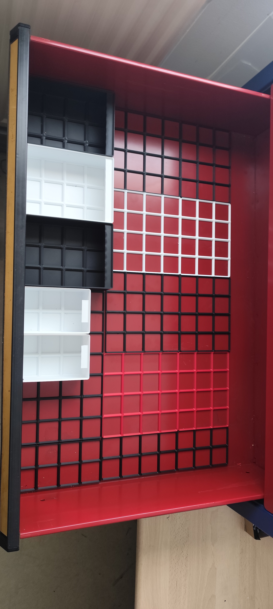
*Figure 11 : Grilles du deuxième tiroir* 

Pour demain, j’ai prévu de commencer l’organisation des tiroirs à vis et à résistances. L’objectif est de mettre en place une logique de rangement simple et facile à comprendre pour n’importe quel utilisateur. Une fois cette logique définie, il faudra également la documenter afin que chacun puisse retrouver rapidement le matériel recherché.

Concernant la mission sur les ordinateurs, nous avons finalement décidé de la reporter.

Une nouvelle mission nous a également été confiée : préparer l’installation de deux nouvelles imprimantes Bambu Lab Mini dans la salle d’impression. Pour cela, il faudra créer un nouvel étage sur l’étagère existante et imprimer les supports nécessaires.

J’ai aussi appris que je devrai fabriquer les grilles pour quatre autres tiroirs au cours de la semaine prochaine.

# Jour 20 : Fin du tiroir des résistances

Aujourd’hui, j’ai terminé l’organisation du tiroir destiné aux résistances. Toutes les boîtes sont désormais en place et le système de rangement est fonctionnel.

*Figure 12 : Tiroir des résistances* 

Pour le classement, nous avons choisi de ranger les résistances par ordre croissant de valeur. On commence par les plus petites valeurs, puis on progresse progressivement jusqu’aux plus grandes. Une fois arrivé en bas d’une colonne, le rangement reprend en haut de la colonne suivante. Cette méthode permet de retrouver rapidement une résistance sans avoir à chercher dans tout le tiroir.

J’ai également terminé l’impression des dernières grilles nécessaires pour le deuxième tiroir à vis. Celui-ci est désormais presque prêt et ne nécessite plus que quelques boîtes supplémentaires pour être entièrement opérationnel.

J’ai aussi corrigé sur le site web le problème de redirection des balises. Désormais, lorsqu’un utilisateur clique sur un mot ou une balise, il est correctement redirigé vers la page correspondante.

Je n’ai finalement pas eu le temps d’étiqueter toutes les boîtes. Cette tâche sera réalisée la semaine prochaine. Il reste également à documenter précisément la logique de rangement du tiroir des résistances afin qu’elle puisse être comprise et utilisée facilement par les autres utilisateurs du Makerspace.

Pour les tiroirs à vis, la logique de rangement n’est pas encore définie. Je prévois de m’en occuper une fois l’ensemble des grilles et des boîtes imprimées. Cette tâche fera partie des objectifs de la semaine prochaine.

---

# Bilan de la semaine

Cette semaine m'a permis de progresser sur plusieurs aspects. J'ai presque terminé le premier tiroir à vis et finalisé la fabrication du tiroir destiné aux résistances, même s'il reste encore l'étiquetage et la documentation de son organisation. J'ai également amélioré ma manière de travailler sur le site web grâce à l'installation de [Jekyll](../Explication/Definitions/#jekyll), ce qui me permets désormais de tester mes modifications en local avant de les publier. Enfin, j'ai approfondi mes connaissances sur l'impression 3D, notamment sur l'impression multicolore et les contraintes liées aux longues séries d'impression. La semaine prochaine sera principalement consacrée à la finalisation des tiroirs, à leur documentation ainsi qu'à l'installation des nouvelles imprimantes 3D.