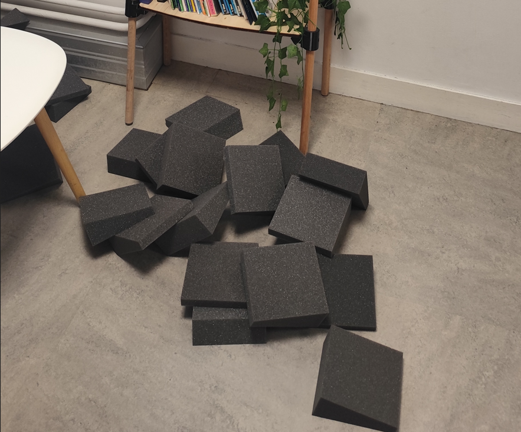
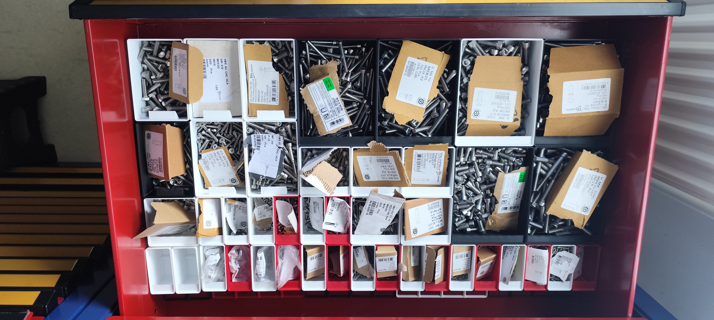
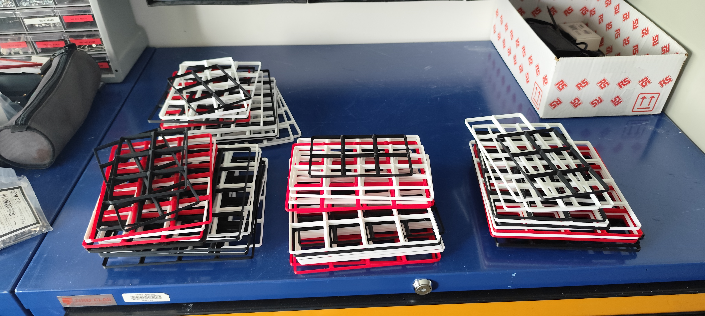
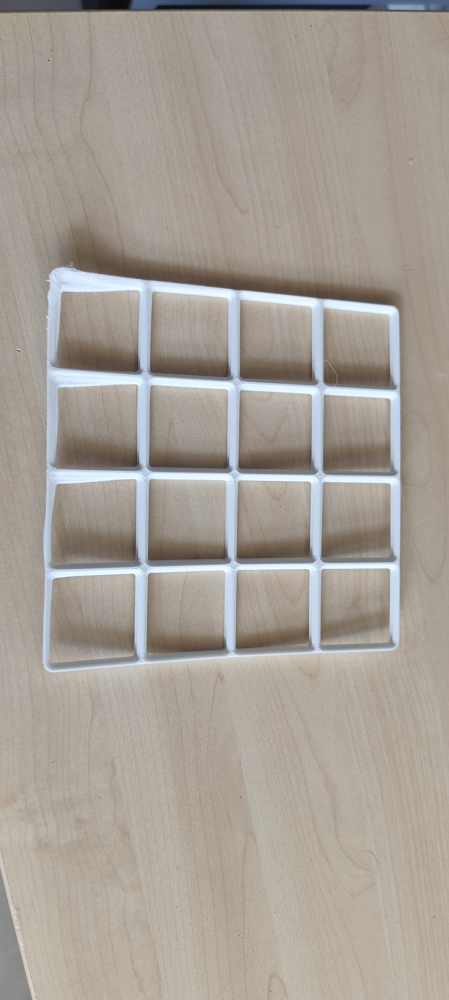
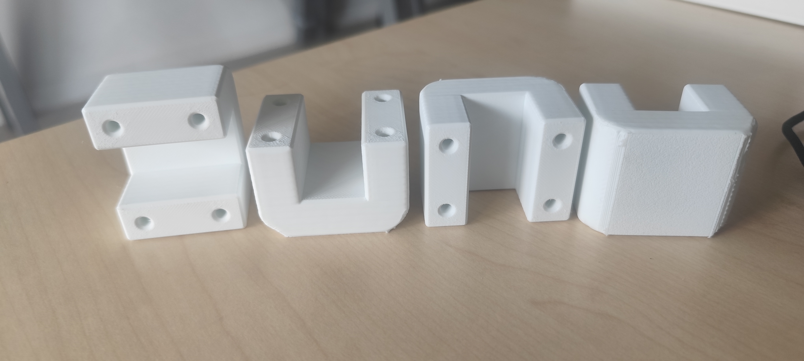
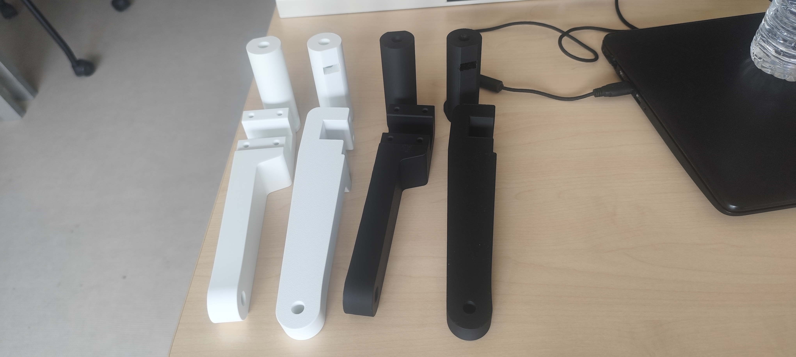
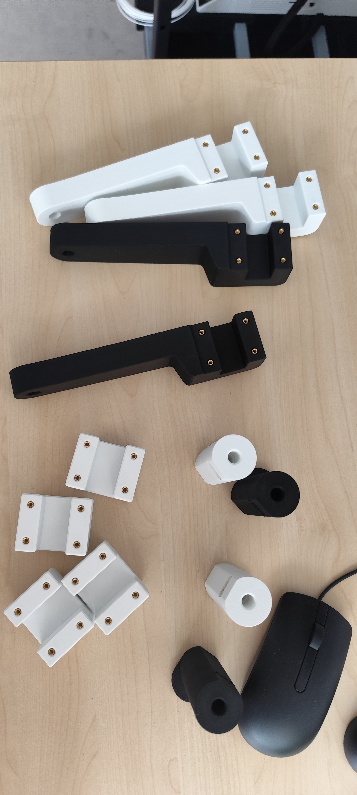
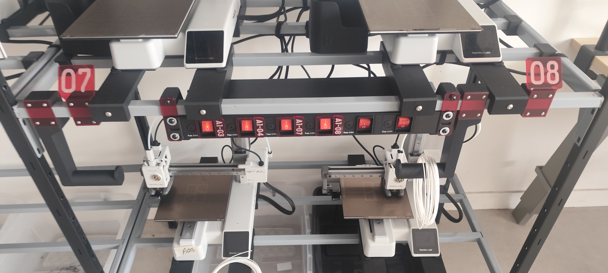
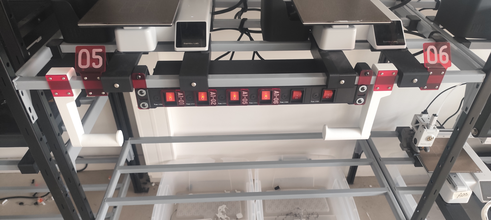

---
layout: default
parent: Documentation continue
nav_order: 6
title: semaine 6
---

# Semaine 6 – Finalisation du rangement Gridfinity et organisation du Makerspace

## Introduction de la semaine

Cette sixième semaine de stage a principalement été consacrée à la finalisation du système de rangement [Gridfinity](../Explication/Definitions.md#gridfinity) pour les tiroirs de stockage. J'ai terminé l'impression des boîtes destinées aux vis et aux écrous, puis j'ai poursuivi la fabrication des grilles nécessaires aux différents tiroirs. Cette semaine m'a également permis de participer à plusieurs tâches d'organisation et d'aménagement des espaces du [Makerspace](../Explication/Definitions.md#makerspace).

---

# Jour 26 et 27 – Jours fériés

Les jours 26 et 27 étaient des jours fériés. Aucune activité de stage n'a donc été réalisée pendant ces deux journées.

# Jour 28 – Poursuite du rangement des tiroirs

En début de journée, nous avons constaté que les mousses acoustiques du MediaLab étaient de nouveau tombées. Malgré l'utilisation d'une quantité supplémentaire de [scotch double face](../Explication/Definitions.md#scotch-double-face), la chaleur de la salle continuait à provoquer leur décollement.

*Mousse au sol suite à la chaleur*

*Mousses acoustiques qui se sont de nouveau décollées à cause de la chaleur.*

Nous avons donc décidé de retirer complètement les mousses ainsi que le scotch qui était resté sur le mur. Cette solution permet de laisser la salle propre en attendant de trouver une méthode de fixation plus adaptée aux conditions de la pièce.

J'ai ensuite terminé le rangement du deuxième tiroir destiné aux vis. Les différentes vis ont été réparties dans les boîtes en suivant la logique de rangement définie précédemment. Il ne restait plus que l'étiquetage des boîtes. Cependant, l'étiqueteuse n'avait plus de papier, et il fallait donc attendre la réception d'une nouvelle commande avant de pouvoir terminer cette étape.

*Deuxième tiroir à vis après le rangement des composants.*

J'ai également poursuivi la fabrication des grilles destinées aux autres tiroirs. Pour le quatrième tiroir, j'ai terminé l'ensemble des grilles nécessaires. Cela représentait quatre grilles de 4 × 4, quatre grilles de 4 × 3, deux grilles de 4 × 2 et une grille de 3 × 2.

J'ai ensuite commencé la grille de l'avant-dernier tiroir. Pour celui-ci, j'ai imprimé huit grilles de 4 × 8, deux grilles de 4 × 2 et une grille de 3 × 2. Il ne me restait alors plus que quatre grilles de 3 × 4 ainsi que les grilles du dernier tiroir à fabriquer.

En parallèle, nous avons déplacé plusieurs cartons du laboratoire 3 vers le laboratoire 4 afin de poursuivre l'organisation des espaces.

# Jour 29 – Fin de l'impression des grilles

Cette journée a permis de terminer l'impression de toutes les grilles nécessaires aux différents tiroirs. Ces grilles sont destinées à être utilisées progressivement par Adrien ou Alban lorsqu'ils auront besoin d'organiser les différents composants.

Pour terminer l'ensemble du stock de grilles, j'ai imprimé les dernières pièces nécessaires, soit huit grilles de 4 × 4, huit grilles de 4 × 3, deux grilles de 4 × 2 et une grille de 3 × 2.

*Ensemble des grilles Gridfinity imprimées pour les différents tiroirs.*

J'ai rencontré un problème lors de l'impression d'une grille de 4 × 4. Les coins de la pièce ont commencé à se soulever à cause du phénomène de [warping](../Explication/Definitions.md#warping). Pour éviter que ce problème ne se reproduise sur les impressions suivantes, j'ai ajouté un [brim](../Explication/Definitions.md#brim) autour de la pièce.

*Grille présentant un défaut lié au warping.*

Le [brim](../Explication/Definitions.md#brim) permet d'augmenter la surface de contact entre la pièce et le plateau d'impression. Cela permet de mieux maintenir les bords de la pièce et de réduire les risques de décollement pendant l'impression.

Une fois les impressions des grilles terminées, j'ai également imprimé les quatre portes-bobines ainsi que les quatre porte-étiquettes nécessaires au Makerspace.

*Portes-bobines imprimés.*

*Porte-étiquettes imprimés.*

Enfin, nous avons aidé l'association UniMakers à déplacer plusieurs tables. Cette tâche m'a permis de participer à l'organisation générale des espaces du [Makerspace](../Explication/Definitions.md#makerspace) en dehors de mon projet principal.

# Jour 30 – Documentation et fabrication des portes-bobines

La semaine a commencé par l'ajout des photos de la première semaine sur mon site de documentation. L'objectif était de commencer à intégrer les photographies prises pendant le stage afin d'illustrer les différentes missions réalisées. Certaines images étaient cependant trop grandes et prenaient trop de place sur les pages. J'ai donc dû adapter leur taille afin qu'elles soient mieux intégrées au site.

En parallèle, nous avons travaillé sur la fabrication des portes-bobines et des porte-étiquettes. Pour assembler certaines pièces imprimées en 3D, nous avons utilisé une machine qui fonctionne sur un principe similaire à un fer à souder afin de mettre en place des [inserts](../Explication/Definitions.md#insert) métalliques.

Un [insert](../Explication/Definitions.md#insert) permet de créer un point de fixation dans une pièce imprimée en 3D. Une fois installé, il permet notamment de visser une pièce sans avoir besoin de réaliser directement le filetage dans le plastique.

<video src="../images/semaine6/VID_insert.mp4" controls muted>
</video>
*Mise en place d'un insert dans une pièce imprimée en 3D.*

*Toutes les piéces avec un insert*

Après cette étape, Raphaël a utilisé la [découpeuse laser](../Explication/Definitions.md#decoupeuse-laser) afin de fabriquer les pièces nécessaires à l'accrochage des portes-bobines. Les différentes pièces ont ensuite été assemblées afin d'obtenir les portes-bobines terminés.

Ensuite Raphaël à fait le montage des portes bobines :

<video src="../images/semaine6/VID_montage.mp4" controls muted>
</video>

Et j'ai installé sur les amoires les portes bobines et les portes étiquettes : 

*Installation des portes-bobines et portes-étiquettes dans le Makerspace.*

Cette activité m'a permis de voir comment plusieurs techniques de fabrication peuvent être utilisées pour réaliser un même objet. Les pièces imprimées en 3D permettent de réaliser les éléments personnalisés tandis que la découpeuse laser permet de fabriquer rapidement des pièces plates servant à l'assemblage.

---

# Bilan de la semaine

Cette semaine a permis de terminer une étape importante du projet de rangement. J'ai terminé l'impression de toutes les boîtes nécessaires aux tiroirs à vis ainsi que l'ensemble des grilles prévues pour les différents tiroirs.

J'ai également pu mettre en pratique mes connaissances concernant les problèmes d'adhérence lors des impressions 3D. Le problème de [warping](../Explication/Definitions.md#warping) rencontré sur une grille m'a notamment permis d'utiliser un [brim](../Explication/Definitions.md#brim) afin d'améliorer l'adhérence de la pièce au plateau.

En parallèle du projet [Gridfinity](../Explication/Definitions.md#gridfinity), j'ai participé à plusieurs tâches d'aménagement du [Makerspace](../Explication/Definitions.md#makerspace), comme le déplacement de tables et de cartons ou encore la tentative de remise en place des mousses acoustiques du MediaLab.

À la fin de la semaine, les grilles sont donc toutes prêtes à être utilisées et les différents tiroirs peuvent progressivement être organisés. Il reste notamment à terminer l'étiquetage des boîtes lorsque le papier de l'étiqueteuse sera de nouveau disponible.