---
layout: default
parent: Documentation continue
nav_order: 8
title: semaine 8
---

# Semaine 8 – Conception d'une boîte à déchets et approfondissement de la conception 3D

## Introduction

Cette huitième semaine de stage a principalement été consacrée à la conception d'une nouvelle boîte destinée à récupérer les déchets produits par les [imprimantes 3D](../Explication/Definitions.md#imprimante-3d). Cette mission m'a permis d'aller plus loin dans l'utilisation d'[Onshape](../Explication/Definitions.md#onshape), notamment en prenant en compte les contraintes réelles de l'environnement dans lequel la pièce doit être utilisée.

J'ai également découvert de nouvelles méthodes de conception et d'[impression 3D](../Explication/Definitions.md#impression-3d), notamment l'utilisation d'un angle de 45 degrés pour limiter l'utilisation de [supports](../Explication/Definitions.md#supports), ainsi que les différences entre les formats de fichiers utilisés en modélisation et en fabrication.

En parallèle, j'ai participé à une nouvelle soutenance blanche, réalisé la [maintenance préventive](../Explication/Definitions.md#maintenance-preventive) d'une imprimante [Bambu Lab X1 Carbon](../Explication/Imprimante.md#bambu-lab-x1-carbon) et participé à une première [impression multicolore](../Explication/Definitions.md#impression-multicolore) avec un [AMS](../Explication/Definitions.md#ams).

---

# Jour 36 – Conception d'une nouvelle boîte à déchets

La journée a commencé par une petite réparation personnelle. J'ai réparé un collier dont l'anneau était cassé en le reformant à l'aide d'une pince.

La mission principale de la journée concernait cependant la conception d'une nouvelle boîte destinée à récupérer les déchets produits par les [imprimantes 3D](../Explication/Definitions.md#imprimante-3d).

L'objectif était d'améliorer la boîte existante afin d'éviter de devoir la vider trop régulièrement. La problématique était donc de concevoir une boîte avec une plus grande capacité tout en respectant les contraintes de l'étagère et des imprimantes situées autour.

J'ai d'abord réfléchi à plusieurs solutions. Une première possibilité aurait été de rendre la boîte plus profonde, mais les imprimantes situées sous l'étagère empêchent d'utiliser davantage d'espace vers le bas. J'ai également envisagé d'augmenter la largeur de la boîte, mais le plateau des imprimantes ne permet pas d'imprimer une pièce suffisamment grande.

Une autre idée consistait à créer des rampes permettant de guider tous les déchets vers un même endroit. Cependant, les câbles et certaines [buse](../Explication/Definitions.md#buse)s se trouvent dans cette zone et empêchent la mise en place de cette solution. De plus, l'espace disponible sur le côté gauche de l'armoire est insuffisant.

La solution retenue a donc été de conserver les dimensions permettant à la boîte de s'emboîter sur les barres métalliques de l'étagère tout en augmentant sa capacité.

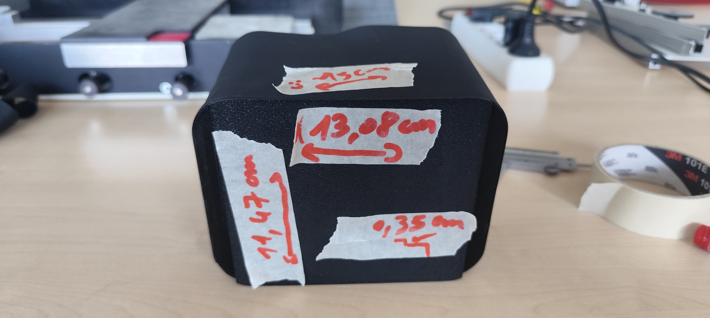

*Relevé des dimensions de l'ancienne boîte afin de conserver le même système de fixation.*

Pour commencer la conception sur [Onshape](../Explication/Definitions.md#onshape), j'ai repris les dimensions de l'ancienne boîte afin que la nouvelle puisse s'emboîter correctement sur les barres métalliques de l'étagère.

J'ai réalisé une première [esquisse](../Explication/Definitions.md#esquisse) composée de deux rectangles. J'ai ensuite utilisé une [extrusion](../Explication/Definitions.md#extrusion) afin d'ajouter de la matière entre ces deux formes. Cette méthode m'a permis de conserver une épaisseur de paroi d'environ un centimètre.

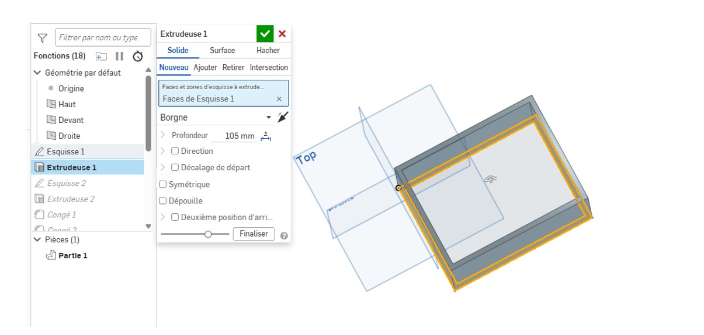

*Première esquisse utilisée pour commencer la conception de la boîte.*

J'ai ensuite réalisé une deuxième [esquisse](../Explication/Definitions.md#esquisse) permettant de créer un passage pour la [buse](../Explication/Definitions.md#buse). L'objectif était que la [buse](../Explication/Definitions.md#buse) ne puisse pas entrer en contact avec la boîte et que les déchets puissent tomber correctement à l'intérieur.

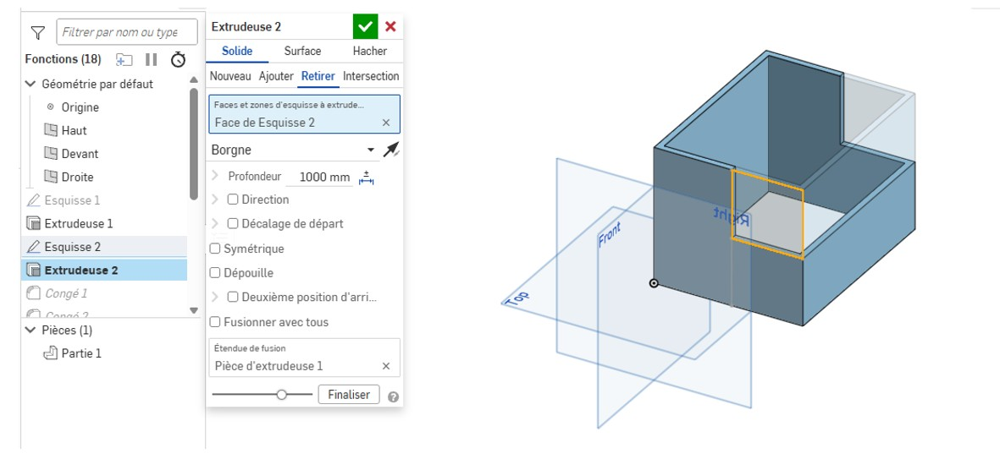

*Conception de la zone permettant aux déchets de tomber dans la boîte.*

J'ai ensuite ajouté plusieurs [congés](../Explication/Definitions.md#conge) sur les bords extérieurs de la boîte. Cela permet d'éviter d'avoir des angles trop pointus qui pourraient provoquer des blessures lors de la manipulation.

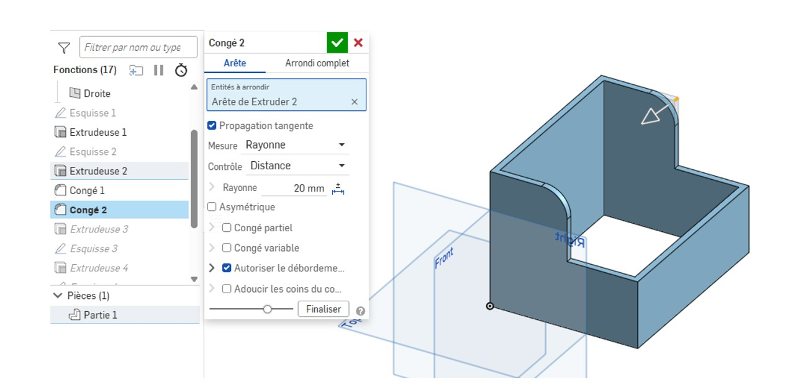

*Arrondissement des bords extérieurs de la boîte.*

Après cela, j'ai réalisé une [extrusion](../Explication/Definitions.md#extrusion) permettant de créer le fond de la boîte.

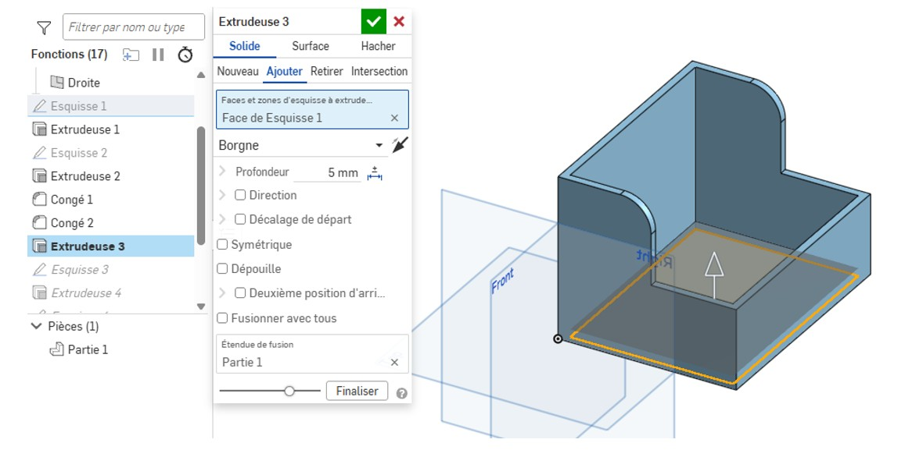

*Création du fond de la boîte.*

J'ai ensuite réalisé une nouvelle [esquisse](../Explication/Definitions.md#esquisse) en prenant en compte la distance entre les barres de l'étagère. Cette étape m'a permis d'agrandir la boîte vers le bas afin d'augmenter sa capacité tout en conservant son système de fixation.

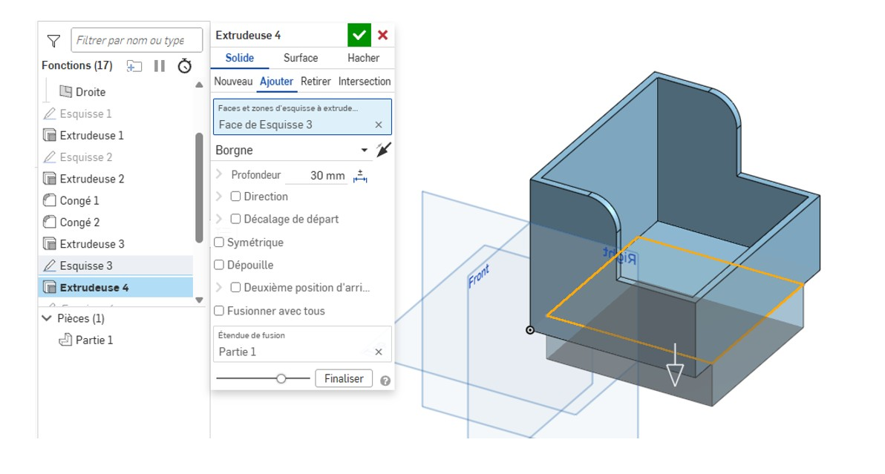

*Prise en compte des dimensions réelles de l'étagère.*

Enfin, j'ai réalisé une [extrusion](../Explication/Definitions.md#extrusion) en enlèvement de matière afin d'augmenter le volume disponible à l'intérieur de la boîte. J'ai également ajouté deux congés à l'intérieur afin d'arrondir les angles et de faciliter la chute des déchets vers le fond.

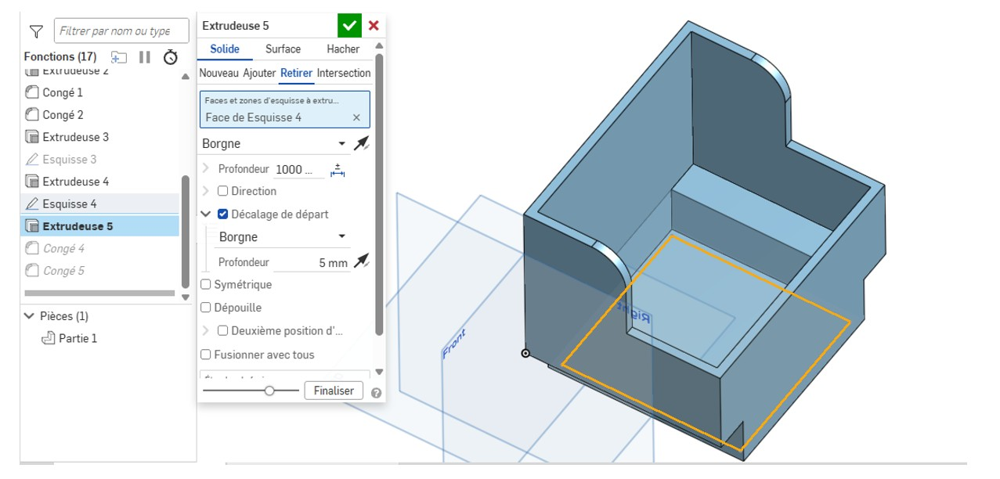

*Conception de l'intérieur de la boîte à déchets.*

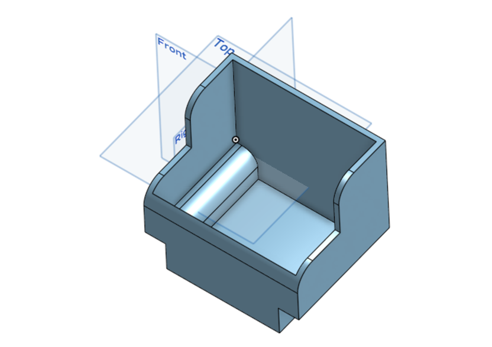

*Boite à déchets finalisé*

# Jour 37 – Amélioration de la conception et prise en compte des contraintes réelles

Cette journée a commencé par la rédaction des explications concernant la conception de la boîte à déchets. La veille, j'avais principalement expliqué les choix réalisés et les raisons de ces choix. J'ai cette fois détaillé les différentes étapes de conception réalisées sur [Onshape](../Explication/Definitions.md#onshape).

J'ai ensuite eu une longue discussion avec Alban afin d'améliorer la conception de la boîte.

Il m'a notamment conseillé de reproduire directement les contraintes réelles de l'étagère dans [Onshape](../Explication/Definitions.md#onshape). J'ai donc modélisé les barres métalliques sur lesquelles la boîte doit venir se fixer. Cela permet de vérifier directement dans le logiciel si ma pièce respecte les dimensions disponibles.

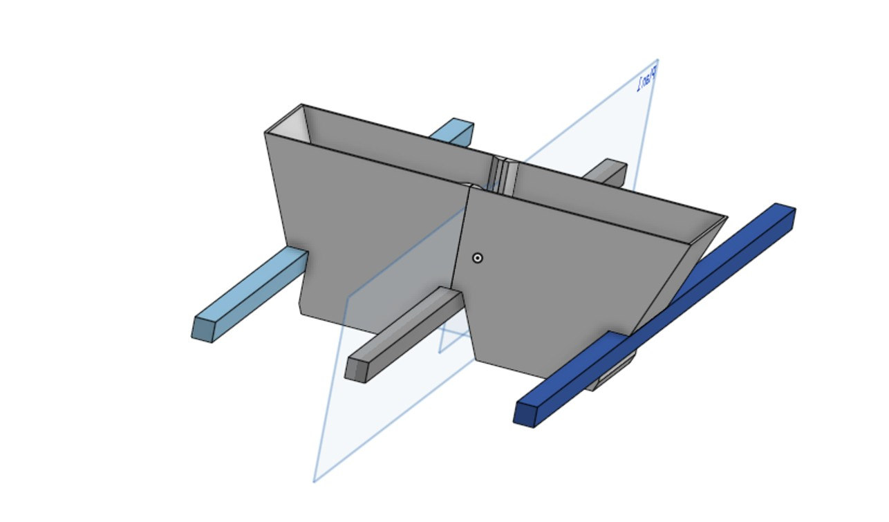

*Reproduction des contraintes réelles de l'étagère dans Onshape.*

J'ai également découvert l'outil [coque](../Explication/Definitions.md#coque) d'[Onshape](../Explication/Definitions.md#onshape). Cet outil permet de retirer de la matière à l'intérieur d'une pièce en conservant une épaisseur définie sur ses parois. Cette méthode est beaucoup plus simple que de réaliser manuellement plusieurs [esquisse](../Explication/Definitions.md#esquisse)s pour créer les parois et le fond de la boîte.

Nous avons également réfléchi à l'orientation de la pièce lors de son impression. Je pensais initialement être limité par la taille du plateau et ne pas pouvoir utiliser les trois barres de l'étagère comme points de fixation.

Cependant, il est possible d'imprimer la pièce avec une orientation à environ 45 degrés. Cette orientation permet de gagner de la place sur le plateau et surtout de réduire fortement le besoin en supports.

Si la pièce était imprimée verticalement, certaines parties nécessiteraient des supports difficiles à retirer et qui pourraient laisser des défauts sur la pièce. L'orientation à 45 degrés permet donc de mieux utiliser le volume disponible tout en améliorant la qualité de fabrication.

J'ai ensuite modifié la boîte afin qu'elle puisse atteindre la deuxième barre de l'étagère tout en respectant cet angle.

Cependant, cette modification a fait apparaître un nouveau problème : une partie de la pièce dépassait du plateau d'impression.

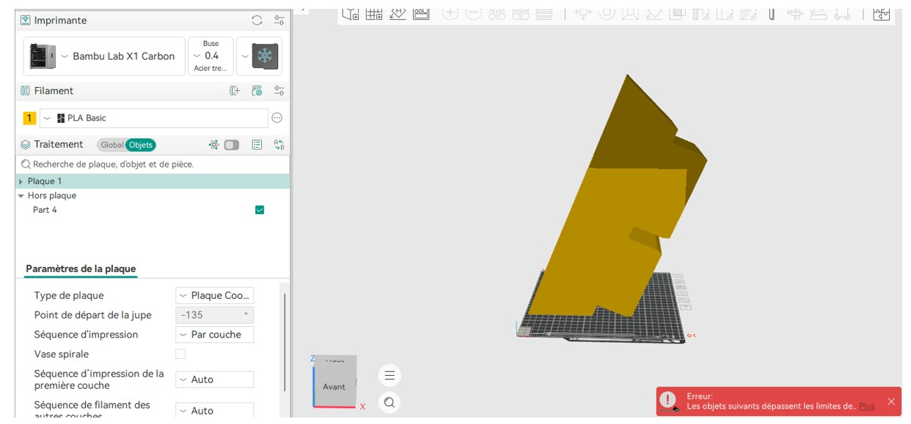

*Partie de la boîte dépassant du plateau d'impression.*

Pour résoudre ce problème, j'ai décidé de séparer la boîte en deux parties. J'ai ensuite réfléchi à un système d'[encoche](../Explication/Definitions.md#encoche) permettant d'assembler correctement les deux parties après leur impression.

# Jour 38 – Adaptation de la boîte pour limiter les supports

Après avoir séparé la boîte en deux parties grâce au système d'encoche, un nouveau problème est apparu.

Je souhaitais que la boîte puisse correctement s'accrocher aux barres de l'étagère tout en conservant une orientation à 45 degrés. Cependant, cette orientation faisait apparaître des zones nécessitant l'utilisation de [supports](../Explication/Definitions.md#supports).

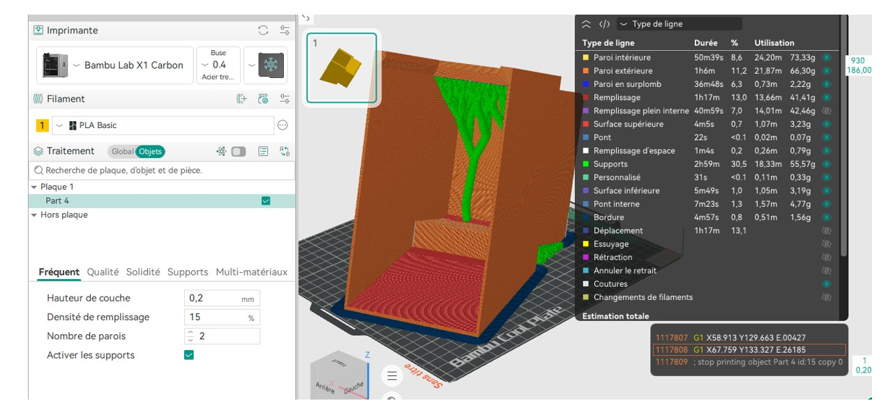

*Zone de la boîte nécessitant des supports*

J'ai donc réfléchi à une nouvelle forme pour le dessous de la boîte afin de respecter l'angle nécessaire tout en limitant les zones nécessitant des [supports](../Explication/Definitions.md#supports).

Cette modification m'a permis de mieux comprendre l'importance de l'orientation d'une pièce avant son impression. Une même pièce peut nécessiter beaucoup de [supports](../Explication/Definitions.md#supports) ou presque aucun support simplement en fonction de la manière dont elle est placée sur le plateau.

J'ai également réalisé une nouvelle soutenance blanche. Cette deuxième présentation était meilleure que la première et prenait en compte les remarques qui m'avaient été données précédemment.

Cependant, plusieurs points restaient à améliorer. J'avais notamment plusieurs [tics de langage](../Explication/Definitions.md#tic-de-langage), notamment l'utilisation répétée de « du coup ».

J'ai également appris qu'il était important de mieux organiser la présentation d'un sujet. Par exemple, pour présenter le [Makerspace](../Explication/Definitions.md#makerspace), il était plus logique de suivre l'ordre « qu'est-ce que c'est, où se trouve-t-il, pourquoi avons-nous ce besoin, puis quelles solutions avons-nous mises en place ».

Cette organisation permet de mieux comprendre le raisonnement et évite de donner des informations dans un ordre qui peut sembler répétitif.

Un autre point important était de mieux montrer mon implication personnelle dans les projets. Il fallait expliquer clairement les réflexions que j'avais réalisées et les choix que j'avais faits afin que le travail présenté ne donne pas l'impression d'avoir été réalisé uniquement par quelqu'un d'autre.

**Accéder au diaporama de la soutenance blanche modifié** : https://drive.google.com/file/d/12Jd32AJvK52eNN-uyKHGR-FirI0FKmUF/view?usp=drive_link (le fichier étant trop volumineux pour github j'ai du mettre un lien pour un google drive)

# Jour 39 – Finalisation de la conception et découverte des formats de fichiers

Pour résoudre définitivement le problème lié aux [supports](../Explication/Definitions.md#supports), j'ai conservé une partie de la base avec un angle de 90 degrés. Cette partie nécessitera des [supports](../Explication/Definitions.md#supports), mais elle permettra à la boîte de se bloquer correctement contre les barres de l'étagère.

Pour le reste de la boîte, j'ai créé une forme courbée permettant de respecter l'angle de 45 degrés. Cette partie ne nécessite ainsi pas de [supports](../Explication/Definitions.md#supports).

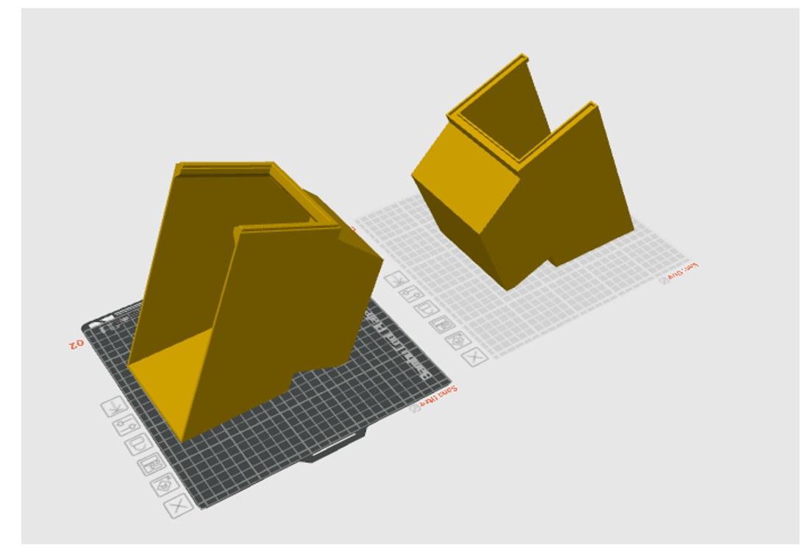

*Version finale de la boîte à déchets avec la partie nécessitant des supports et la partie inclinée.*

Cette solution a été validée par Alban. Cette mission m'a permis de découvrir une technique de conception plus avancée et de mieux comprendre comment adapter une pièce aux contraintes de fabrication.

J'ai également appris la différence entre plusieurs formats de fichiers utilisés dans la conception et l'[impression 3D](../Explication/Definitions.md#impression-3d).

Le format [STEP](../Explication/Definitions.md#step) est un format de modélisation qui permet de conserver les informations nécessaires à la modification d'une pièce. Un fichier [STEP](../Explication/Definitions.md#step) peut être ouvert dans différents logiciels de modélisation et peut continuer à être modifié après son exportation.

À l'inverse, les formats [STL](../Explication/Definitions.md#stl) et [3MF](../Explication/Definitions.md#3mf) sont principalement utilisés pour la fabrication. Ils décrivent la géométrie de la pièce sous forme de petits triangles permettant aux logiciels d'impression de préparer la fabrication. Ils sont donc moins adaptés à la modification de la conception dans un logiciel de modélisation.

J'ai également réalisé une opération de [maintenance préventive](../Explication/Definitions.md#maintenance-preventive) sur une [Bambu Lab X1 Carbon](../Explication/Imprimante.md#bambu-lab-x1-carbon).

La machine dispose d'un système permettant d'indiquer lorsqu'une opération de maintenance doit être réalisée. Un QR code permet ensuite d'accéder aux instructions nécessaires pour effectuer la procédure.

Pour réaliser cette opération, j'ai commencé par mettre les équipements de protection nécessaires. J'ai notamment utilisé des gants et un masque lors de la manipulation de l'alcool utilisé pour nettoyer les composants de la machine.

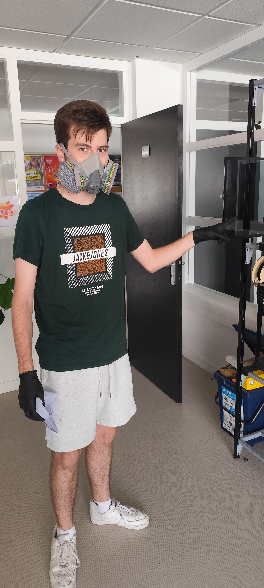
*Équipements utilisés lors de la maintenance.*

J'ai nettoyé les [vis trapézoïdales](../Explication/Definitions.md#vis-trapezoidale) qui permettent au plateau de se déplacer verticalement. Pour cela, j'ai utilisé un tissu avec de l'alcool afin de retirer les anciennes saletés et résidus.

J'ai ensuite appliqué la graisse prévue pour la machine sur les vis afin d'assurer leur bon fonctionnement.

<iframe width="560" height="315"
src="https://www.youtube.com/embed/pv_Pta3ASQk"
frameborder="0" allowfullscreen>
</iframe>
*Vidéo nettoyage de l'imprimante*

<iframe width="560" height="315"
src="https://youtu.be/pLaLseYa-9I"
frameborder="0" allowfullscreen>
</iframe>
*Deuxième vidéo nettoyage de l'imprimante*

Une fois la maintenance terminée, j'ai indiqué à l'imprimante que l'opération avait été réalisée. J'ai ensuite rangé le matériel utilisé et jetée les déchets produits pendant l'opération.

Cette intervention m'a permis de comprendre qu'une [imprimante 3D](../Explication/Definitions.md#imprimante-3d) nécessite également un entretien régulier pour conserver de bonnes performances et limiter les problèmes mécaniques.

J'ai également aidé Raphaël à réaliser une [impression multicolore](../Explication/Definitions.md#impression-multicolore) destinée à son panneau en 3D.

Pour réaliser cette impression, il fallait d'abord séparer le modèle en plusieurs parties afin de pouvoir attribuer une couleur différente à chaque élément.

J'ai sélectionné les différentes lettres afin de leur attribuer une couleur spécifique, puis j'ai choisi une autre couleur pour le reste de la pièce.

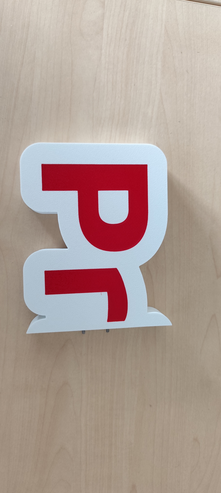
*Impression multicouleur*

*Timelapse impression multicouleur*

L'impression a été réalisée avec l'[AMS](../Explication/Definitions.md#ams) de la [Bambu Lab X1 Carbon](../Explication/Imprimante.md#bambu-lab-x1-carbon). Il s'agissait de ma première expérience avec une [impression multicolore](../Explication/Definitions.md#impression-multicolore).

Cette expérience m'a permis de mettre en pratique les connaissances que j'avais acquises précédemment sur le fonctionnement de l'[AMS](../Explication/Definitions.md#ams) et sur les changements de [filament](../Explication/Definitions.md#filament) nécessaires lors d'une [impression multicolore](../Explication/Definitions.md#impression-multicolore).

# Jour 40 – Lancement de l'impression et fin du stage

Pour terminer la mission de conception de la boîte à déchets, j'ai lancé son impression.

L'impression étant particulièrement longue, avec une durée prévue d'environ sept heures, je ne pourrai pas observer directement la fin de la fabrication puisque mon stage se termine à ce moment-là. Alban devra donc vérifier le résultat final de l'impression et me transmettre une photo afin de confirmer que la pièce a correctement été fabriquée. 

L'après-midi, nous nous sommes rendus à la Machinerie à Amiens afin de réaliser nos ESS (des journées associatives obligatoires). La Machinerie est est aussi un FATLAB avec d'autres machines que le makerspace. Cette visite nous à permis d'utiliser les compétences acquises au [Makerspace](../Explication/Definitions.md#makerspace).
J'ai pu revoir Alban dans l'après midi et il m'a dit que la partie gauche de la boite c'était bien imprimée mais que la partie droite à rencontrer un défaut d'impression, elle a commencé à faire des spaghettis (à ne plus suivre son tracé mais à quand meme imprimer ce qui donne l'impression que observe des spaghettis) à la toutes fins de l'impression. 

Cette dernière semaine m'a permis de mettre en pratique de nombreuses compétences développées pendant le stage. J'ai notamment pu travailler sur la conception 3D, l'[impression 3D](../Explication/Definitions.md#impression-3d), la maintenance d'une machine, la documentation et la préparation d'une présentation.

---

# Bilan de la semaine

Cette dernière semaine a principalement été consacrée à la conception d'une nouvelle boîte à déchets pour les [imprimantes 3D](../Explication/Definitions.md#imprimante-3d). Cette mission m'a permis de partir d'un problème concret, de rechercher plusieurs solutions puis de concevoir une pièce en tenant compte des contraintes réelles de l'environnement.

J'ai approfondi mon utilisation d'[Onshape](../Explication/Definitions.md#onshape) en découvrant de nouveaux outils comme la [coque](../Explication/Definitions.md#coque) et en apprenant à reproduire directement les contraintes physiques dans le logiciel. J'ai également appris à réfléchir à l'orientation d'une pièce afin de limiter l'utilisation de [supports](../Explication/Definitions.md#supports) et d'optimiser l'espace disponible sur le plateau d'impression.

La [maintenance préventive](../Explication/Definitions.md#maintenance-preventive) de la [Bambu Lab X1 Carbon](../Explication/Imprimante.md#bambu-lab-x1-carbon) m'a permis de découvrir l'importance de l'entretien régulier d'une [imprimante 3D](../Explication/Definitions.md#imprimante-3d) et de suivre un protocole de maintenance.

J'ai également réalisé ma première [impression multicolore](../Explication/Definitions.md#impression-multicolore) avec un [AMS](../Explication/Definitions.md#ams), ce qui m'a permis de mettre en pratique les connaissances acquises au cours des semaines précédentes.

Enfin, les différentes soutenances blanches m'ont permis d'améliorer ma manière de présenter mon travail. J'ai compris qu'il était important d'expliquer clairement le contexte, la problématique, les solutions envisagées et les choix que j'ai personnellement réalisés.

Ce stage m'a finalement permis d'acquérir de nouvelles compétences techniques, mais également de développer ma capacité à travailler en équipe, à communiquer mes idées, à résoudre des problèmes et à documenter mon travail.