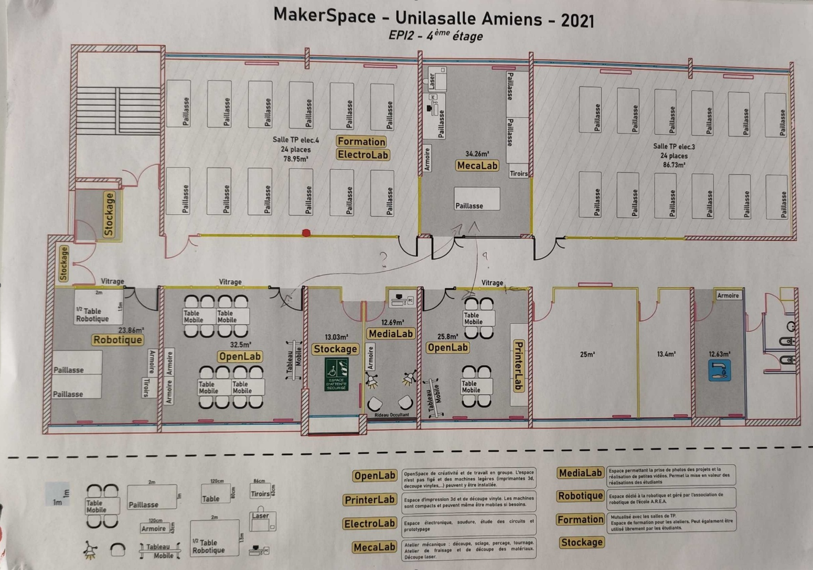
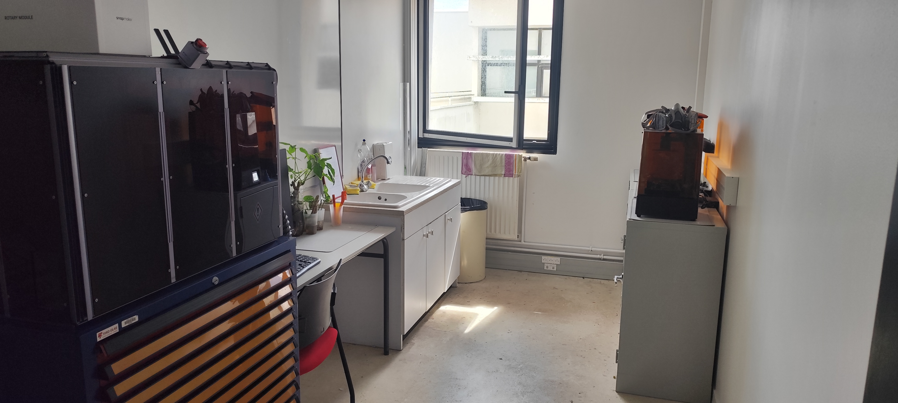
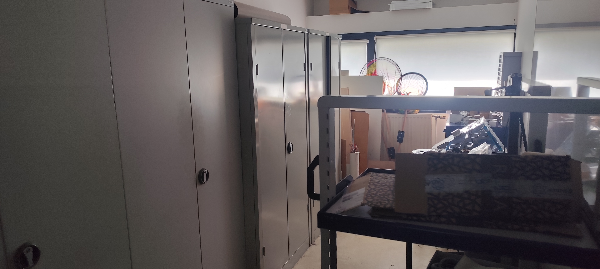
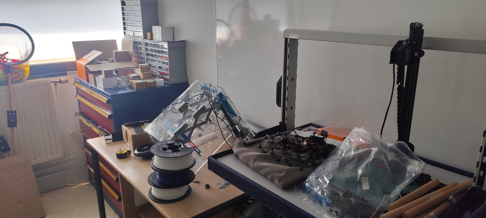

---
layout: default
nav_order: 2
title: Makerspace
---

# Le Makerspace

## Un espace pour réaliser ses projets

Le Makerspace est un espace qui permet de passer d'une idée à une réalisation concrète crée par Adrien BRAQ. Il met à disposition différents espaces, machines et outils permettant de travailler sur des projets très variés. Le principe est de pouvoir choisir le matériel adapté en fonction de ce que l'on souhaite réaliser.

Dans mon stage, j'ai notamment pu utiliser plusieurs espaces du Makerspace pour réaliser mes différentes missions. Chaque salle possède des équipements spécifiques et permet de répondre à un besoin différent.

Cette page sert à décrire tout se qu'on peut trouver au makerspace comme salle. 

*Plan Makerspace*

## La salle d'impression 3D

La salle d'impression 3D permet de fabriquer des pièces directement à partir de modèles numériques. Elle dispose de plusieurs imprimantes 3D, notamment des Bambu Lab A1 Mini, des Bambu Lab P1P et une Bambu Lab X1 Carbon.

C'est dans cette salle que j'ai réalisé une grande partie de mon projet de rangement. J'ai pu y fabriquer les différentes grilles et boîtes du système Gridfinity, mais également d'autres pièces comme les portes-bobines, les porte-étiquettes et la boîte destinée à récupérer les déchets des imprimantes.

L'impression 3D permet donc de créer rapidement une pièce adaptée à un besoin précis et de modifier le modèle si le premier résultat ne convient pas.

## Le Resin Lab

Le Resin Lab est l'espace dédié à l'impression 3D utilisant de la résine. Il permet de réaliser des pièces avec un autre procédé que les imprimantes 3D à filament.

Cette salle possède également du matériel et des espaces de stockage spécifiques à cette méthode de fabrication.

Lors de mon stage, j'ai notamment travaillé sur la réorganisation de cette salle et sur le déplacement de la servante contenant du matériel, afin d'améliorer l'organisation de la zone de stockage.

## La salle d'électronique (anciennement le Repair Space)

La salle dédiée à l'électronique permet de réaliser des projets électroniques et de travailler sur des cartes et des composants.

On y trouve notamment le matériel nécessaire pour réaliser du brasage et assembler des composants électroniques. Cette salle permet également de travailler sur la fabrication et la modification de circuits imprimés.

C'est notamment dans cet espace que j'ai pu découvrir la récupération de composants sur une carte électronique et apprendre à utiliser le matériel nécessaire pour les dessouder.

## La salle des découpeuses laser (Mechalab)

La salle des découpeuses laser permet de travailler à partir de matériaux en plaques afin de réaliser des pièces découpées ou gravées.

Cette machine est particulièrement intéressante lorsqu'une pièce doit être fabriquée dans un matériau comme le bois. Elle permet donc de compléter l'impression 3D, puisque toutes les pièces d'un projet ne sont pas forcément adaptées à l'impression.

Lors de mon stage, Raphaël a notamment utilisé la découpeuse laser pour réaliser les pièces nécessaires à la fixation des portes-bobines.

## Le MediaLab

Le MediaLab est un espace consacré à la création de contenu multimédia. Il permet notamment de réaliser des vidéos, d'enregistrer du son ou encore de travailler sur des créations graphiques et du dessin.

Cet espace peut être utilisé pour documenter un projet, réaliser une présentation ou créer différents supports permettant de communiquer autour d'une réalisation.

J'ai notamment eu l'occasion de travailler autour de cet espace lors de la remise en place des mousses acoustiques.

## La salle de stockage

La salle de stockage est la partie du makerspace dédiée au rangement des bobines de filament, des vis, des écrous, des inserts et des anciens projets. Elle permet également de conserver certains prototypes réalisés auparavant.
Des zones de stockage sont présentes dans chaque salle, mais l’intérêt de la salle de stockage est de garantir que nous ne manquons jamais de composants. On ne l’utilise que lorsque les éléments nécessaires ne sont plus disponibles dans les salles dédiées.
Cela permet d’éviter toute rupture de stock, car si un composant n’est plus présent dans une salle, il faut alors procéder à une commande.

## L'association Unimakers

Le Makerspace accueille également l'association **Unimakers**, qui travaille notamment sur la conception et la fabrication de robots destinés à participer à des compétitions de robotique.

## Un espace adapté à chaque projet

L'intérêt principal du Makerspace est donc de pouvoir combiner plusieurs technologies pour réaliser un même projet.

Une pièce peut par exemple être conçue sur un logiciel de modélisation 3D, puis fabriquée avec une imprimante 3D. Une autre partie peut être découpée au laser, tandis que l'électronique peut être réalisée dans la salle dédiée. Le MediaLab peut ensuite permettre de créer une vidéo ou un autre support pour présenter le projet.

Cela permet de passer progressivement de la **conception** à la **fabrication**, puis aux **tests et à l'amélioration** du projet.

Dans mon stage, j'ai pu utiliser cette complémentarité entre les différents espaces pour réaliser mes missions. Le Makerspace met ainsi à disposition un ensemble de ressources qui permettent de trouver une solution adaptée à de nombreux besoins.

